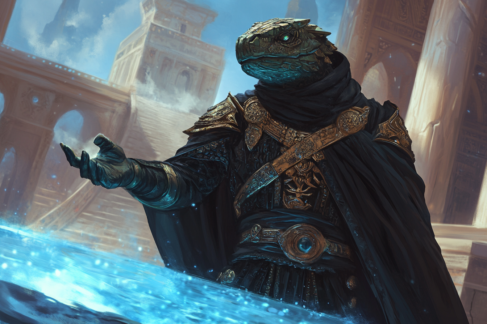
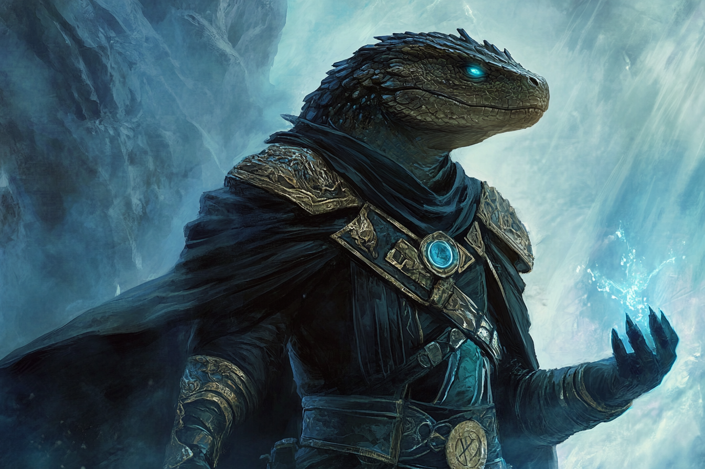
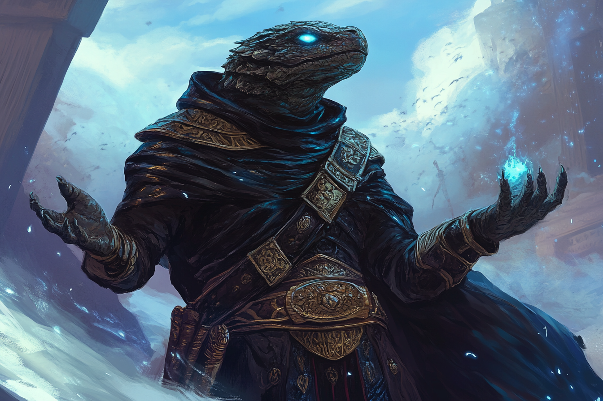

# Anaximandros Andreadis - Grand prêtre de Komorath
| | |
|-|-|
|||
|||

## Infos 

| Âge | Espèce | Occupation | Alignement | MBTI |
| --- | ------ | ---------- | ---------- | ---- |
| 35 ans | Saurien-Sombraur | Grande prêtre | Lawful Evil| ISTJ |

## Localisation actuelle
[**Rovtal**](../../VILLES/Rovtal.md)

## Filiations
* [Astrée Andreadis](../ROVTAL/Astrée_Andreadis.md) - Soeur

## Groupes 
* [Famille Andreadis](../ROVTAL/GROUPES/Famille_Andreadis.md)
* [Sombres Artistes](../../VILLES/Rovtal.md#les-sombres-artistes)

## Caractéristiques
* Membre de la famille royale, il a été exilé des [**Tréfonds**](../../VILLES/Rovtal.md#tréfonds) parce que sa foi n'est pas aligné avec les cultes autorisées de la ville.
* Frère de la reine actuelle de **Rovtal**, il a été contacté par [Ethérios](./Ethérios_Sfer.md) afin de venir renforcer les rangs des **Mains Noires**, ce qu'il a accepté.
    * Cette approbation lui a nécessité de vénérer **Komorath**, ce qu'il n'a pas su cacher, d'où son exil.
    * Il n'a pas encore fait ses preuves, il ne sera pas donc transformé en [**Sombraur**](../../ESPECES/ESPECES_MAGIQUES/Sombraur.md) tout de suite.
* Certaines personnes dans la **famille royale** trouvent cet exil injuste, ce qui donne confiance en **Anaximandros** sur le fait de pouvoir faire un jour un coup d'état.

## Événements marquants
* **429** : Contacté par [**Etherios Sfer**](./Ethérios_Sfer.md) pour venir servir les **Mains Noires**, il a commencé à vénérer **Komorath**, ce qui lui a valu son exil. 
* **2 Dhens 432** : Son lien avec les **Sombres Artistes** est découvert par les Aventuriers, et doit s'enfuir du [Temple de Komorath](../../VILLES/Rovtal.md#le-temple-de-komorath-surface)
* **3 Dhens 432** : Il est transformé en Sombraur afin de répondre à la menace des aventuriers au cas où.

## Combat
S.O.

## Roleplay
* Pauses sauriennes
* Être un peu dépressif dans la voix, mais déterminé dans les paroles