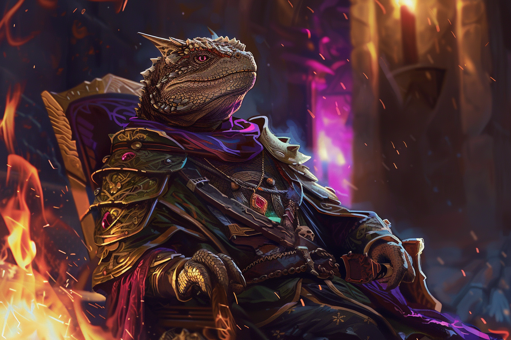
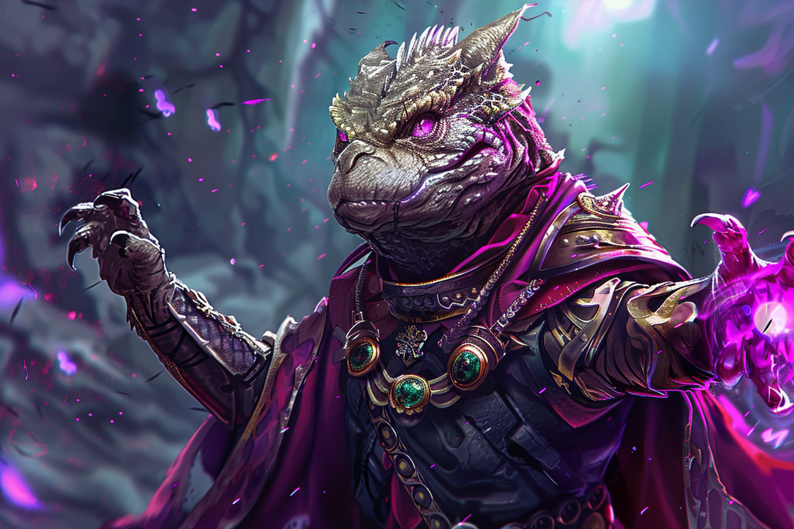
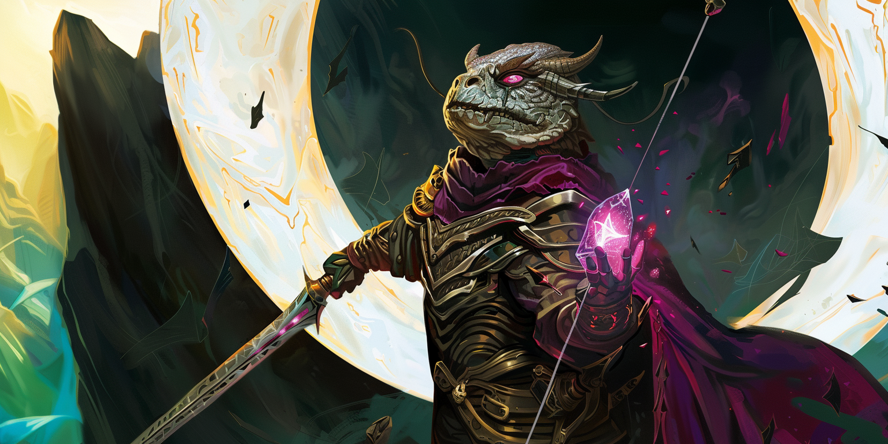

# Ethérios Sfer / Etherios I - Main Noire

## Infos 
| Âge | Espèce | Occupation | Alignement | MBTI |
| --- | ------ | ---------- | ---------- | ---- |
| 352 ans | Saurien / Sombraur | Main Noire | Lawful Evil | INTJ |

## Localisation actuelle
[Rovtal](../../VILLES/Rovtal.md)

## Filiations
* [Therra Sfer](../BRUMEBOURG/Therra_Sfer.md) - Ancêtre (Ascendant au 8ème degré) - Cousin éloigné (fausse identité)
* [Emiliano Sfer](../DVOLSTI/Emiliano_Sfer.md) - Ancêtre (Ascendant au 8ème degré) - Cousin éloigné (fausse identité)

## Groupes 
[Les Sombres Artistes](../../VILLES/Rovtal.md#les-sombres-artistes)

## Caractéristiques
* Chef de la [**famille Sfer**](../ROVTAL/GROUPES/Famille_Sfer.md) depuis **300 ans**
* Il se fait passer depuis **300 ans** pour lui-même et son fils à la fois, et maintient l'illusion que ce sont plusieurs personnes qui se succèdent à la tête de la famille.
    * L'ensemble de la famille pense qu'il s'agit actuellement d'**Etherios VIII**.
    * Etherios II et Etherios III étaient véritablement quelqu'un d'autre, son fils qu'il a eu avant de se transformer en Sombraur, et le fils de ce dernier. 
    * Etherios II a eu le temps d'avoir d'autres enfants, qui ont assuré la préservation de la lignée.
    * **Etherios** a assassiné son fils et son petit-fils et les a remplacé par des illusions lorsqu'il a senti qu'il devenait trop vieux pour continuer à vivre sans que les autres ne se posent de question quant à sa longévité.

## Événements marquants
* **112** : Il a un enfant, **Etherios II**.
* **115** : A **35 ans**, se fait transformer par [**Federi Gox**](./Federi_Gox.md) en **Sombraur**.
* **117** : Il pousse [**Federi Gox**](./Federi_Gox.md) à refonder son ancien clan, sous le nouveau nom des [**Sombres Artistes**](../../VILLES/Rovtal.md#les-sombres-artistes).
* **132** : Devient le chef de la [**famille Sfer**](../ROVTAL/GROUPES/Famille_Sfer.md) à la mort de son oncle.
* **161** : **Etherios II** a un enfant, **Etherios III**.
* **166** : Il assassine son fils et son petit-fils, se fait passer pour mort, et prend la place de son fils en tant que dirigeant légitime de la famille, tout en maintenant une illusion sur son apparence et sur son petit-fils. Il enchaîne à travers les années ce cycle, en se faisant passer pour mort.
* **291** : Un membre de la famille découvre la supercherie. Il est obligé d'abandonner son identité de l'époque, **Etherios V**, et de prendre la suivante.
* **395** : Il devient acquiert son identité actuelle, **Etherios VIII**, chef de la famille Sfer.

## Combat

## Roleplay
* Pauses sauriennes
* Parler avec des archaïsmes langagiers
* Voix rauque
* Être extrêmement poli