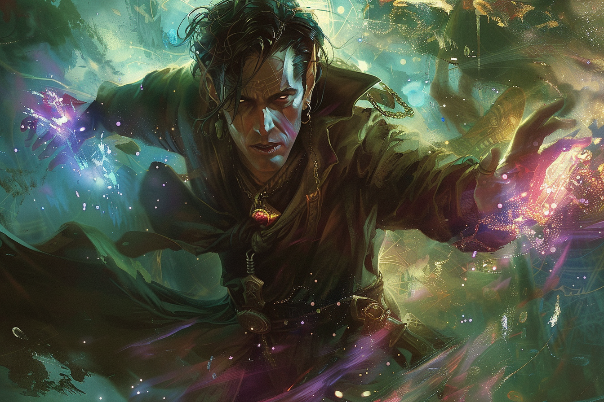

# Federi Gox - Main Noire

## Infos 
| Âge | Espèce | Occupation | Alignement | MBTI |
| --- | ------ | ---------- | ---------- | ---- |
| 665 ans | Elfe de feu / Sombraur | Main Noire | Chaotic Neutral | INFP |

## Localisation actuelle
[Rovtal](../../VILLES/Rovtal.md)

## Filiations

## Groupes 
[Les Sombres Artistes](../../VILLES/Rovtal.md#les-sombres-artistes)

## Caractéristiques
* Il est né à une période avant l'apparition des **stabilisateurs naturels**, et est donc né dans un **clan nomade** d'elfes ayant personnifié le [plan des Lumières et des Ombres](../../../WORLDBUILDING/COSMOLOGIE/PLANS_ET_DIVINITES/Komorath.md) en un dieu du nom de **Komorath**.
* Il a passé sa jeunesse à faire des expérimentations sur la magie afin de pouvoir rentrer en contact avec **Komorath**, ce qui a été vu comme un blasphème par les membres de son clan, et qui l'ont banni.
* Il se dirige ensuite vers des zones riches en **magie**, et réussit à y ouvrir très rapidement un portail vers le [plan des Lumières et des Ombres](../../../WORLDBUILDING/COSMOLOGIE/PLANS_ET_DIVINITES/Komorath.md). 
* Après plusieurs tentatives, il arrive à canaliser assez d'énergie pour se transformer en **Sombraur**.
* Après sa transformations, il erre en se nourrissant de toute la magie qu'il arrive à trouver, profitant notamment du déplacement des clan nomades d'un lieu à l'autre pour trouver ses proies.
* L'**isolement** prolongé l'affecte de plus en plus, et il devient obsédé par le fait de trouver un moyen de se rendre pérènnement dans le plan de son *dieu*, pour ne plus être seul.
* Il a créé son propre clan **nomade**, où il a transformé certaines personnes en **Sombraurs** et a gardé les autres en tant que cultistes. Cependant, ce clan a été décimé lors de la [**catastrophe magique**](../../AUTRES/CatastropheMagique.md) qu'il y a eu lors de la création des **stabilisateurs magiques**.
* Il rencontre quelques années après [Alvaro Shenzi](./Alvaro_Shenzi.md) et [Maria Ufassa](./Maria_Ufassa.md), avec qui il s'installe à [**Rovtal**](../../VILLES/Rovtal.md) de façon définitive.
* Il noue des liens avec les différentes familles nobles de **Rovtal**, notamment avec la famille [**Sfer**](../ROVTAL/GROUPES/Famille_Sfer.md), et le fils du chef de famille, [**Ethérios Sfer**](./Ethérios_Sfer.md) alors très jeune, qu'il transformera plus tard en **Sombraur**.
* Il travaille depuis sur des moyens d'ouvrir pérénnement des portails vers le [plan des Lumières et des Ombres](../../COSMOLOGIE/PLANS_ET_DIVINITES/Komorath.md), sans succès.
* Il passe son temps à **Rovtal** à créer des artefacts magiques qu'il peut vendre pour subsister à ses besoins. 

## Événements marquants
* **-233** : Naissance
* **-207** : Est bani de son clan pour cause d'expérimentation dangereuse sur la magie.
* **-204** : Federi devient le premier **Sombraur**.
* **-187** : Il réussit à créer de nouveaux **Sombraurs**.
* **-94** : Il crée son propre clan pour éviter l'**isolement**.
* **0** : [**Catastrophe magique**](../../AUTRES/CatastropheMagique.md), le clan est décimé.
* **1** : Recueille [Alvaro Shenzi](./Alvaro_Shenzi.md) alors âgé d'un an, après avoir décimé son clan.
* **21** : Transformation d'[Alvaro](./Alvaro_Shenzi.md).
* **37** : Rencontre avec [Maria Ufassa](./Maria_Ufassa.md) puis transformation.
* **95** : Il s'installe à [**Rovtal**](../../VILLES/Rovtal.md) et se rapproche progressivement des instances de décision de la ville, notamment les familles nobles. 
* **115** : Il transforme [Ethérios Sfer](./Ethérios_Sfer.md) âgé de **35 ans** en [**Sombraur**](../../ESPECES/ESPECES_MAGIQUES/Sombraur.md).
* **117** : Remonte un nouveau *clan*, [**les Sombres Artistes**](../../VILLES/Rovtal.md#les-sombres-artistes), sous l'impulsion et grâce à [Ethérios Sfer](./Ethérios_Sfer.md).
* **380** : Se met en hibernation car pense qu'il ne trouvera pas tout de suite réponse à ses questions sur l'ouverture du portail.

## Combat

## Roleplay
* Accent italien
* Très calme