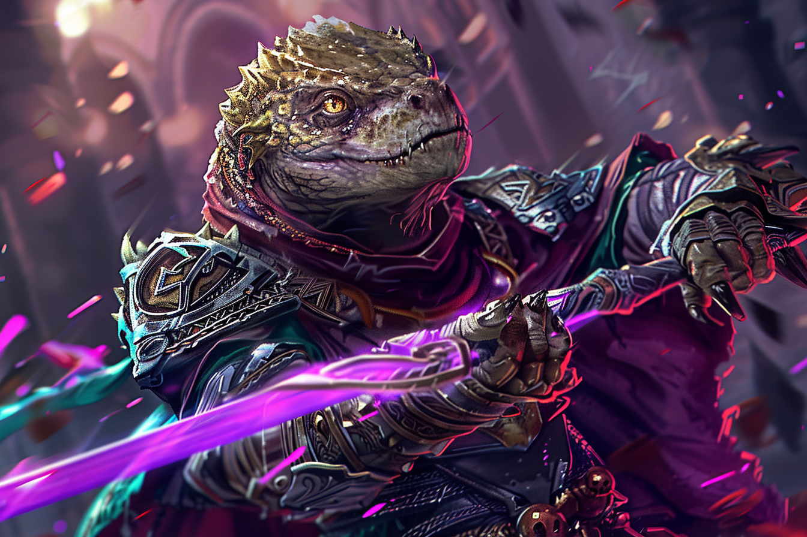

# Lazaros Alexandros - Main Noire

## Infos 
| Âge | Espèce | Occupation | Alignement | MBTI |
| --- | ------ | ---------- | ---------- | ---- |
| 147 ans | Saurien / Sombraur | Main Noire | True Neutral | ENFP |

## Localisation actuelle
[Rovtal](../../VILLES/Rovtal.md)

## Filiations
* [Elèctre Alexandros](../DVOLSTI/Elèctre_Alexandros.md) - Membre éloigné de la famille

## Groupes 
[Les Sombres Artistes](../../VILLES/Rovtal.md#les-sombres-artistes)

## Caractéristiques
* S'est fait passer pour mort auprès de sa famille, mais continue de vivre parmi eux pour récolter des informations.
* Il continue à travailler dans les **finances et les impôts** en cachant son identité.

## Événements marquants
* **285** : Naissance
* **327** : [**Etherios Sfer**](./Ethérios_Sfer.md) entre en contact avec lui car il y a un enjeu à avoir quelqu'un d'infiltré chez les **Alexandros**.
* **338** : Vu ses nombreux services, il se fait transformer par [**Etherios**](./Ethérios_Sfer.md) en **Sombraur**.

## Combat
* [Stats](../../../STAT_BLOCKS/CLASS/SombraurGuerrier.md)

## Roleplay
* Pauses sauriennes
* Très jovial en parlant