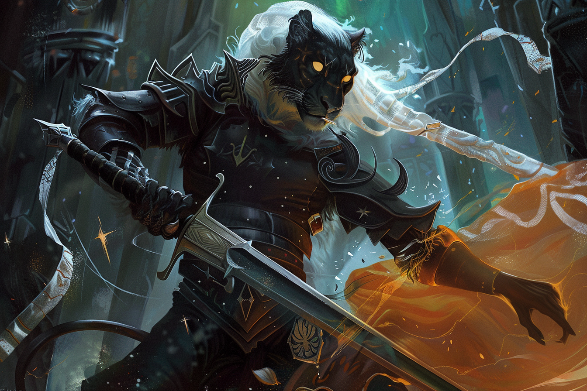

# Maria Ufassa - Main Noire

## Infos 
| Âge | Espèce | Occupation | Alignement | MBTI |
| --- | ------ | ---------- | ---------- | ---- |
| 352 ans | Léonin / Sombraur | Main Noire | Lawful Evil | INTJ |

## Localisation actuelle
[Rovtal](../../VILLES/Rovtal.md)

## Filiations

## Groupes 
[Les Sombres Artistes](../../VILLES/Rovtal.md#les-sombres-artistes)

## Caractéristiques
* Elle rencontre [Federi](./Federi_Gox.md) et [Alvaro](./Alvaro_Shenzi.md) quelques dizaines d'années après la [**catastrophe magique**](../../AUTRES/CatastropheMagique.md) alors qu'ils sont encore dans un mode de vie **nomade**. A l'époque, les premières villes commencent à se former, et elle les pousse à aller s'installer dans une.
* Elle s'occupe de toutes les missions d'assassinat depuis qu'elle s'est installée à [**Rovtal**](../../VILLES/Rovtal.md).
* Elle adore se faire passer pour des gens qu'elle n'est pas en ville.

## Événements marquants
* **15** : Naissance
* **37** : Rencontre avec [Federi](./Federi_Gox.md) et [Alvaro](./Alvaro_Shenzi.md), puis transformation en **Sombraur**.
**95** : Installation à **Rovtal**.

## Combat
* [Stats](../../../STAT_BLOCKS/CLASS/Sombraur.md)

## Roleplay
* Accent espagnol
* Dédaigneuse