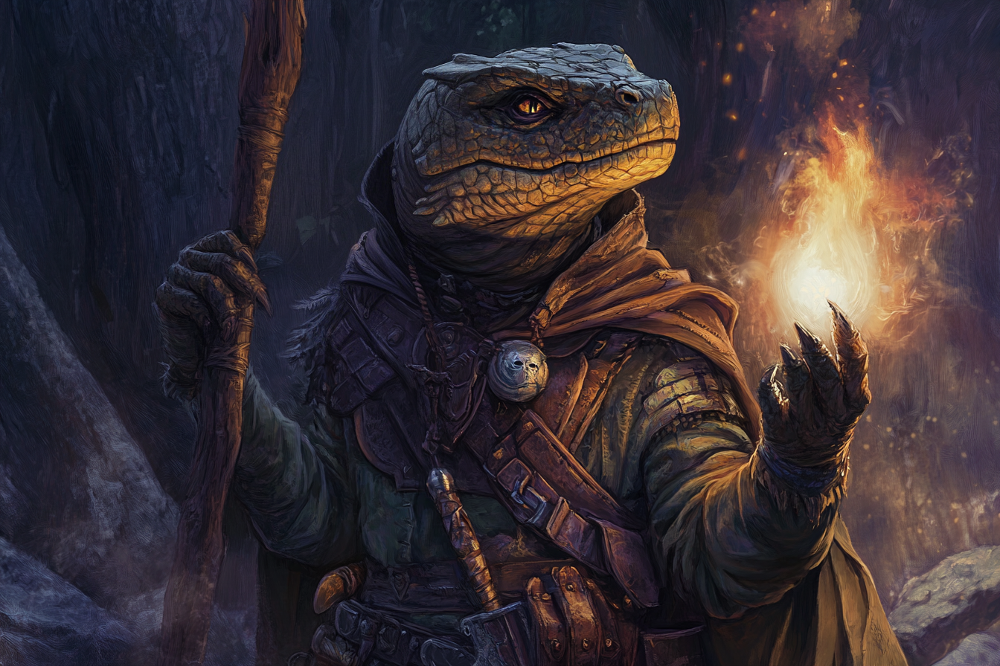

# Nikas Pourokos - Sombre Artiste

## Infos 

| Âge | Espèce | Occupation | Alignement | MBTI |
| --- | ------ | ---------- | ---------- | ---- |
| 22 ans | Saurien | Sombre Artiste | Lawful Neutral| ISTJ |

## Localisation actuelle
[**Rovtal**](../../VILLES/Rovtal.md)

## Filiations

## Groupes 
* [Sombres Artistes](../../VILLES/Rovtal.md#les-sombres-artistes)

## Caractéristiques
* 

## Événements marquants
* **429** : Rejoint le [**Temple de Komorath**](../../VILLES/Rovtal.md#le-temple-de-komorath-surface) de la Surface, sous l'impulsion de sa famille qui ne croit pas en les deux cultes de **Muhuta** et d'**Italis**, vus comme deux divinités pour les personnes riches.
* **431** : A rejoint les Sombres Artistes après s'être entretenu avec [Anaximandros Andreadis](./AnaximandrosAndreadis.md).

## Combat
[Stats](../../../STAT_BLOCKS/CLASS/FanatiqueDeSecte.md), variante **Ombre**.

## Roleplay
* Pauses sauriennes
* Rythme calme