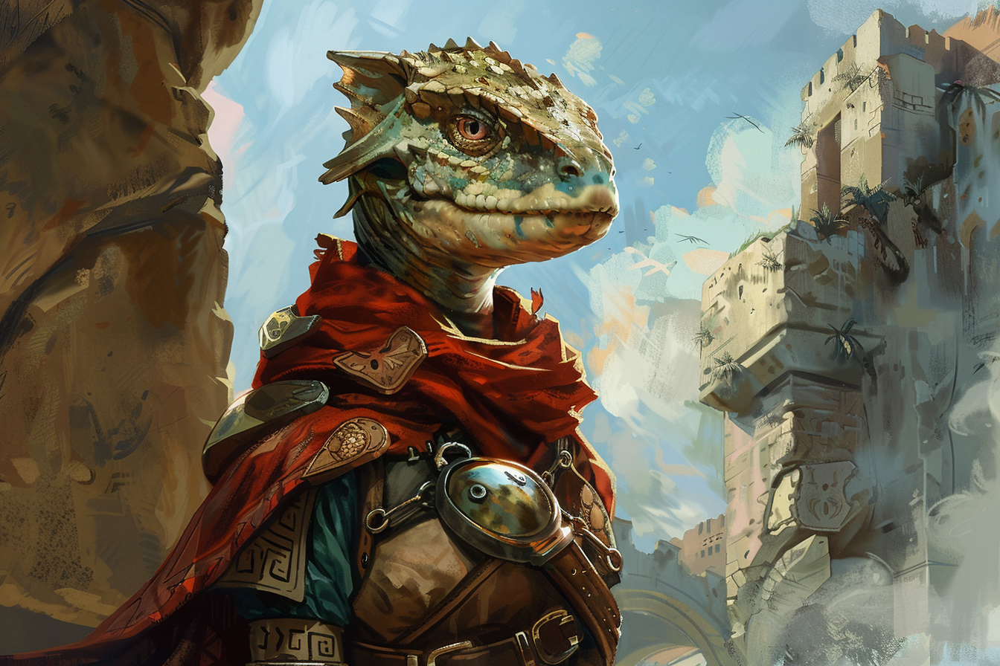

# Valéria Samaras / Valéria Botzaris - Main Noire / Vice-cheffe de la Fabrique des Cristaux

## Infos 
| Âge | Espèce | Occupation | Alignement | MBTI |
| --- | ------ | ---------- | ---------- | ---- |
| 94 ans | Saurien / Sombraur | Main Noire | Lawful Neutral | ISTJ |

## Localisation actuelle
[Rovtal](../../VILLES/Rovtal.md)

## Filiations

## Groupes 
* [Les Sombres Artistes](../../VILLES/Rovtal.md#les-sombres-artistes)

## Caractéristiques
* Cheffe des troupes des [*Sombres Artistes*](../../VILLES/Rovtal.md#les-sombres-artistes).
* Dirige l'ensemble des petites mains de la secte pour faire le travail ingrat.
* Est vice gérante de la [Fabrique de Cristaux](../../VILLES/Rovtal.md#la-fabrique-de-cristaux), qui cache en son sein un chemin menant vers des grottes enfouies.
* Adopte deux identités :
    * La sienne, **Valéria Botzaris**, celle d'une vieille dame de 94 ans, à la retraite ;
    * Celle de la vice-cheffe de la **Fabrique de Cristaux**, **Valéria Samaras**, afin de pouvoir trouver de la main d'oeuvre facile pour les **Sombres Artistes** et pouvoir faire fuir plusieurs cristaux.

## Événements marquants
* **340** : Naissance
* **379** : Assure une haute position dans la [**guilde des ingénieurs**](../../VILLES/Rovtal.md#la-guilde-des-ingénieurs) de **Rovtal**.
* **384** : Se fait transformer par [**Etherios**](./Ethérios_Sfer.md).
* **415** : Adopte sa nouvelle identité (**Valéria Samaras**), et rejoint la [**Fabrique de Cristaux**](../../VILLES/Rovtal.md#la-fabrique-de-cristaux).
* **421** : Devient la vice-cheffe de la [**Fabrique de Cristaux**](../../VILLES/Rovtal.md#la-fabrique-de-cristaux).

## Combat
* [Stats](../../../STAT_BLOCKS/CLASS/SombraurGuerrier.md)

## Roleplay
* Pauses sauriennes
* Rigoler de façon maniaque