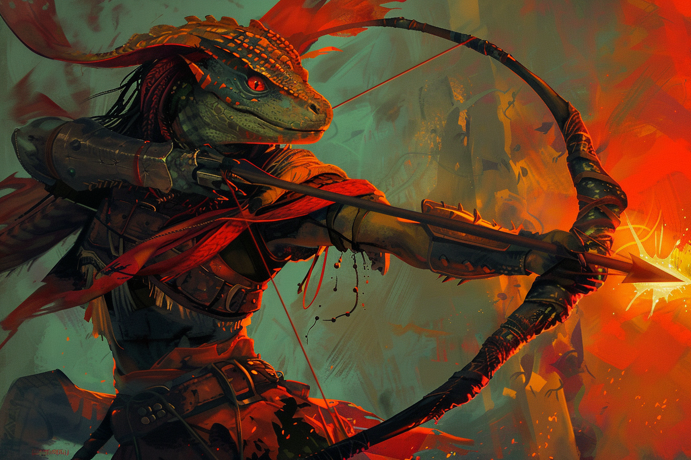

# Valéria Botzaris - Main Noire

## Infos 
| Âge | Espèce | Occupation | Alignement | MBTI |
| --- | ------ | ---------- | ---------- | ---- |
| 94 ans | Saurien / Sombraur | Main Noire | Lawful Neutral | ISTJ |

## Localisation actuelle
[Rovtal](../../VILLES/Rovtal.md)

## Filiations

## Groupes 
* [Les Sombres Artistes](../../VILLES/Rovtal.md#les-sombres-artistes)

## Caractéristiques
* Cheffe des troupes des [*Sombres Artistes*](../../VILLES/Rovtal.md#les-sombres-artistes).
* Dirige l'ensemble des petites mains de la secte pour faire le travail ingrat.

## Événements marquants
* **340** : Naissance
* **379** : Assure une haute position dans la [**guilde des ingénieurs**](../../VILLES/Rovtal.md#la-guilde-des-ingénieurs) de **Rovtal**.
* **384** : Se fait transformer par [**Etherios**](./Ethérios_Sfer.md).

## Combat

## Roleplay
* Pauses sauriennes
* Rigoler de façon maniaque