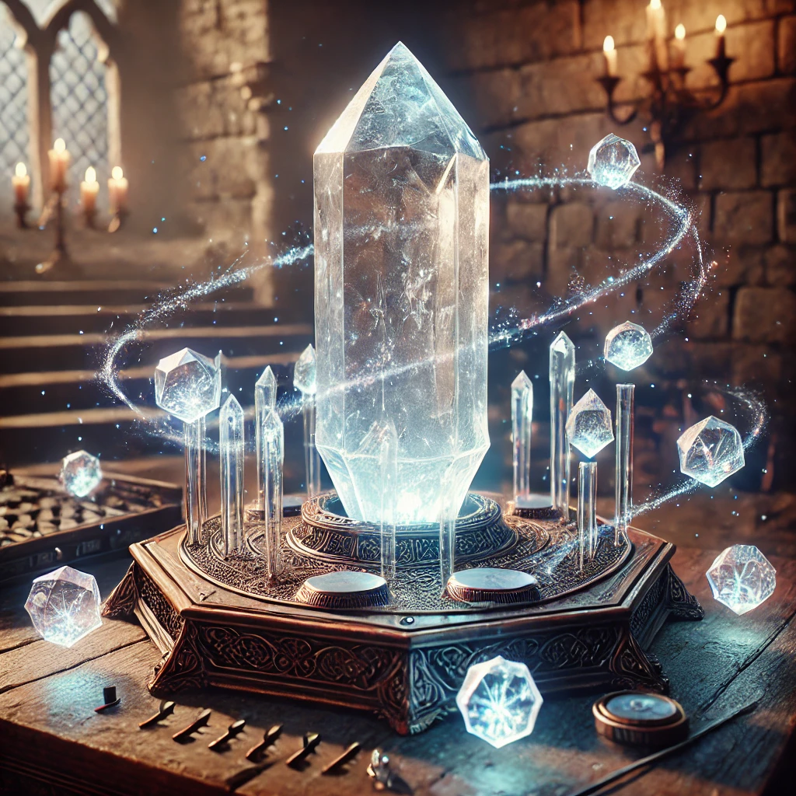
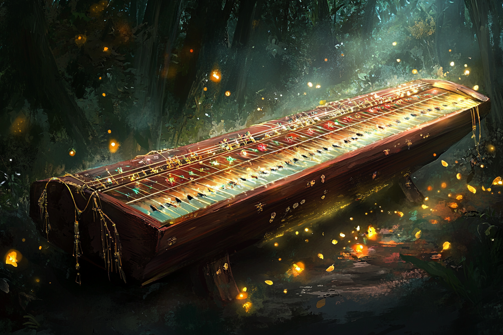

# Instruments de musique

## Eclatolyre

L'**Eclatolyre** est un instrument musical qui utilise un cristal central pour **produire de la lumière**. Ce cristal principal est entouré par des cristaux plus petits qui peuvent être manipulés pour changer l'intensité et la couleur de la lumière émise. 

L'instrument peut également être connecté à des cristaux de plus **grande taille**, dits **cristaux amplificateurs**, pour augmenter la portée de l'éclairage produit. 

Ces fonctionnalités permettent à l'Eclatolyre d'être utilisé non seulement pour des performances musicales mais aussi pour des applications pratiques telles que l'éclairage de grands espaces.

Les **cristaux lumineux** qu'on retrouve dans les **Tréfonds** de [Rovtal](../VILLES/Rovtal.md) se basent sur le même type de technologie.

## Cithare éthérée

La **Cythare Éthérée** est un instrument unique, spécialement conçu pour les mélomanes. Chaque corde de cet instrument est liée à un **mini-cristal** contenant des séquences sonores préenregistrées. 

En faisant vibrer ces cordes, le musicien peut déclencher et manipuler ces séquences pour produire une gamme variée de sons. La maîtrise de la manipulation des cordes permet de **moduler** et d'**alterner** ces sons de manière complexe, permettant aux musiciens de créer des paysages sonores riches et enveloppants, idéaux pour des performances solo captivantes ou des accompagnements lors de grands événements et cérémonies.