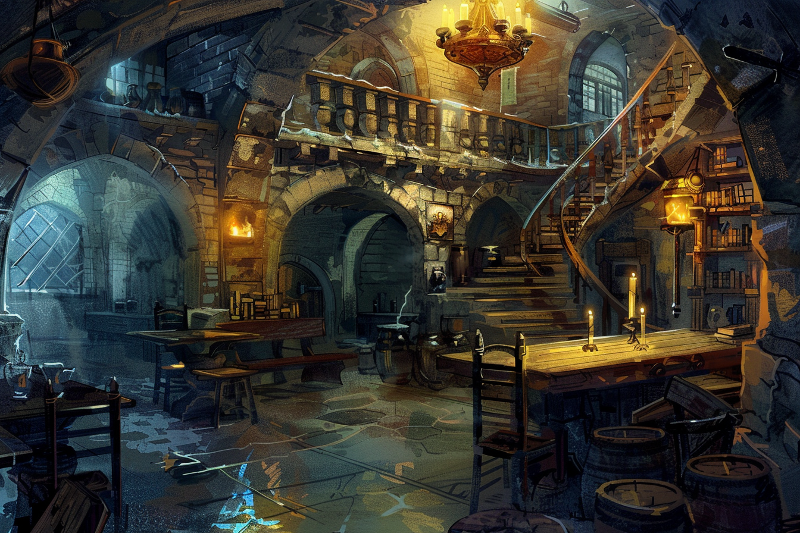
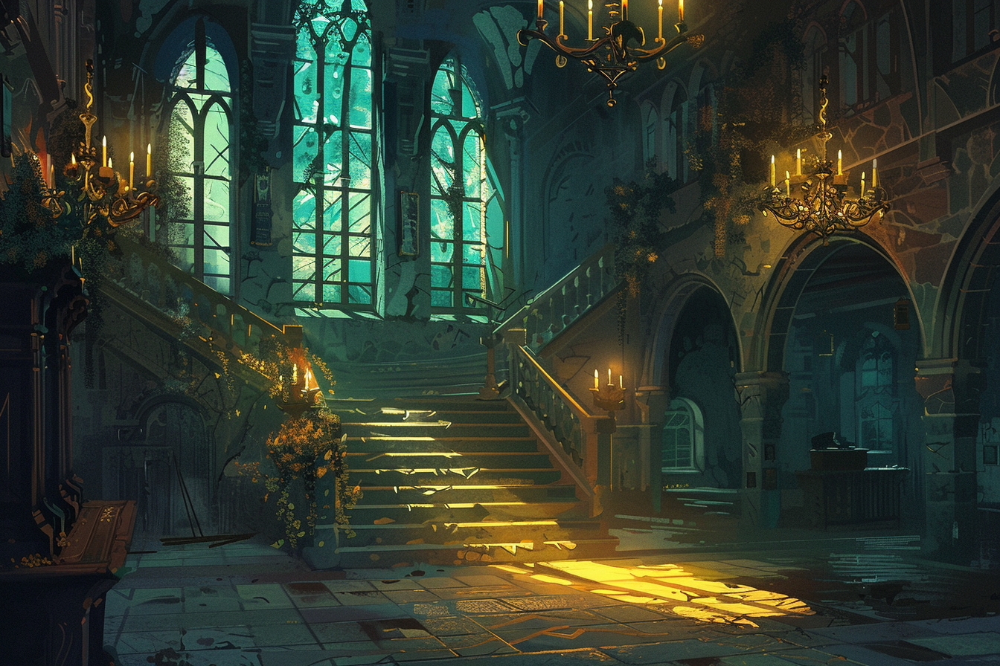
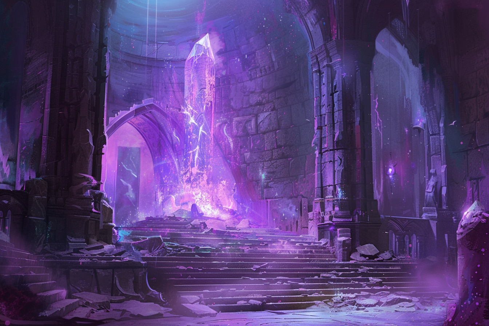
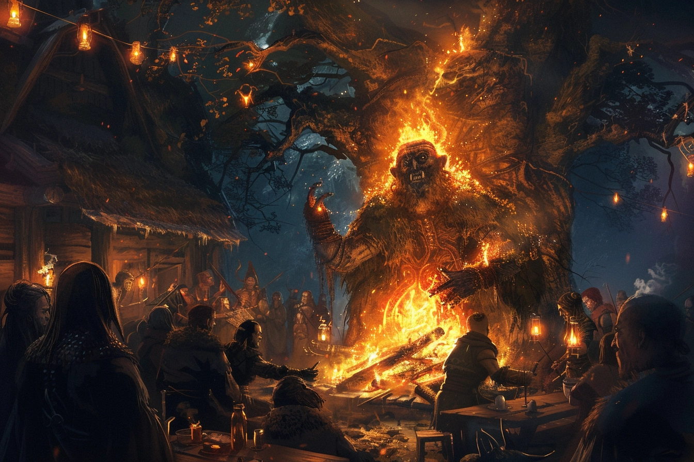

# Brumebourg

## Présentation
**Brumebourg** est un petit village situé à 50km à l'Est de **Dvolsti**. Très axé autour de l'agriculture, le village a tout appris deu savoir-faire de Rovtal.Ce sont quelques centaines d'habitants qui travaillent tous les jours aux champs afin de pouvoir produire assez de nourriture qu'ils exportent ensuite aux villes voisines. 

Village assez modeste, tout le monde se connaît très bien et se rassemblent souvent le soir à la tarverne du village, le [Chat en Boule](#le-chat-en-boule---taverne), afin de discuter, parler de la journée, et déguster des plats préparés par le tavernier. Plusieurs structures et institutions sont présentes en plein coeur du village : forgeron, école, un hotêl de ville qui abrite l'envoyé de Rovtal, une écurie, etc. 

Outre son agriculture, Brumebourg est également connue pour son chantier naval et son port de passage, positionné directement sur le fleuve mais qui ne connecte malheuresement pas les parties les plus actives de la partie Ouest de la Côte Epineuse.

Les habitants de Brumebourg accordent une grande importance à leur anciens : les plus âgés sont très respectés, et une fête s'organise chaque solstice en l'honneur des défunts : les [Veillées des Ancêtres](#la-veillée-des-ancêtres). Ces veillées sont très attendues par l'ensemble de la population, et leurs formes changent grandement en fonction de la saison, l'été étant généralement réservé pour les célébrations joyeuses, tandis que l'hiver est réservé pour le recueillement. Sous l'influence de Rovtal, ces veillées sont en été sous la tutelle de [Muhuta](../COSMOLOGIE/PLANS_ET_DIVINITES/Muhuta.md), déesse du Renouveau, et en hiver sous la tutelle d'[Italis](../COSMOLOGIE/PLANS_ET_DIVINITES/Italis.md), dieu de la Mort et de la Vie.

De façon générale, la vie à Brumebourg est vue comme une vie assez traditionnelle, puisque le niveau de vie reste assez modeste : on peut encore croiser certains habitants qui souhaitent encore aller chasser ou cueillir dans les environs afin de changer un peu de la nourriture qui est élevées près du village.

Assez régulièrement, certains des habitants feront tout le pélerinage jusqu'à [Dvolsti](./Dvolsti.md) afin de récupérer des ressources qu'on ne trouve pas au village (pour l'ensemble des artisans de Brumebourg notamment), et en profitent échanger des ressources produites dans le village contre des nouvelles du monde. 

## Cartes

## Lieux
### L'hôtel de ville

Siège du pouvoir de Brumebourg, on y retrouve l'envoyé de Rovtal qui a son bureau à l'étage, ainsi que le stabilisateur de leyline qui se trouve au sous-sol.

### Le Chat en Boule - Taverne 
La seule taverne du village idéalement située sur la place principale, elle est tenue par un couple de Félinoïdes, **Lana Spat** et son mari **Kramer Grishka**. Ils ont un fils, **Fego**, toujours près à aider ses parents pour apporter des boissons aux clients.

L'ensemble des vivres est stocké au sous-sol, tandis que l'ensemble des chambres sont au premier étage.

### Les Cornes d'Acier - Forge, Armurerie
SItuée sur la place principale du village, elle est tenue par l'imposant minotaure **Vick Ohm**. Le matériel vient souvent à manquer, mais le maître des lieux fait des merveilles avec ce qui lui est donné de manipuler.

### La Fière Barque - Chantier Naval
Chantier naval fluival de Brumebourg, il a été offert par **Rovtal** au village au moment où le village s'est allié officiellement à Rovtal.

### Le Bois Vert - Menuiserie
L'atelier s'occupe également de fournir tout le village en bois. 

### La Langue qui Pique - Epicerie
La seule épicerie du village, qui se contente généralement d'importer les marchandises des plus grandes villes. Il est arrivé que les propriétaires aient besoin d'aller chercher des végétaux eux-mêmes pour compléter leurs  stock.

### La Ferme de la Colline - Ferme
Plus grande ferme du village, située sur une colline. Elle est l'établissement qui exporte le plus en dehors du village.

### Le stabilisateur de leyline - Hôtel de ville

C'est l'ouvrage artificiel qui assure la stabilité des leylines autour de Brumebourg, ce qui assure donc la sûreté et la pérénnité de la ville. Il se trouve au sous-sol de l'hôtel de ville, et cette information n'est pas connue du grand public.

## Événements marquants

* **9 Kegn 432** : Lors du **Festival des Brumes**, plus précisément lors de la **Célébration du Feu**, l'organisation criminelle des [**Enfants de la Rue**](./Dvolsti.md#les-enfants-de-la-rue) a attaqué **Brumebourg**, profitant de la confusion pour s'en prendre au stabilisateur de leyline, ainsi qu'a [Therra](../PERSONNAGES/BRUMEBOURG/Therra_Sfer.md), l'envoyée de Rovtal. Tous les habitants en sont ressortis indemnes, mais le stabilisateur a été gravement amoché.

## Traditions et particularités

### Festival des Brumes
Tous les printemps, le village de **Brumebourg** organise le Festival des Brumes, célébrant les nouvelles récoltes du village et la fin de l'hiver, marqué par ses brumes permanentes. A cette occasion, tout le village s'anime et tous les habitants se reconvertissent le temps du festival afin de l'organiser. Toutes les festivités sont animés par [l'envoyée de **Rovtal**](../PERSONNAGES/BRUMEBOURG/Therra_Sfer.md) qui fait office de représentant du pouvoir.

Plusieurs habitants et commerçants montent des stands dans tout le village, et les emplacements à côté de la place centrale sont très convoités. On y retrouve surtout des stands à propos de l'agriculture en général, mais aussi des stands en tout genre (jeux, spectacles, etc.)

#### La Célébration de Feu

La première nuit de chaque **Festival des Brumes**, une statue gigantesque de bois et paille est brûlée, ce qui constitue l'une des plus grandes attractions du festival. 

Le feu allumée lors de **Célébration de Feu** symbolise les habitants du village qui éloignent les brumes pour l'en délivrer.  

### La Veillée des Ancêtres

