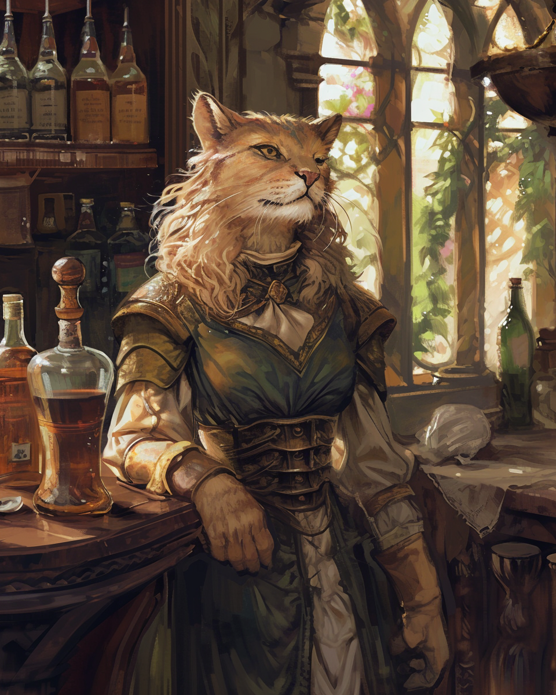

# Brumebourg

## Présentation
**Brumebourg** est un petit village situé à 50km à l'Est de **Dvolsti**. Très axé autour de l'agriculture, le village a tout appris deu savoir-faire de Rovtal.Ce sont quelques centaines d'habitants qui travaillent tous les jours aux champs afin de pouvoir produire assez de nourriture qu'ils exportent ensuite aux villes voisines. 

Village assez modeste, tout le monde se connaît très bien et se rassemblent souvent le soir à la tarverne du village, le [Chat en Boule](#le-chat-en-boule---taverne), afin de discuter, parler de la journée, et déguster des plats préparés par le tavernier. Plusieurs structures et institutions sont présentes en plein coeur du village : forgeron, école, un hotêl de ville qui abrite l'envoyé de Rovtal, une écurie, etc. 

Outre son agriculture, Brumebourg est également connue pour son chantier naval et son port de passage, positionné directement sur le fleuve mais qui ne connecte malheuresement pas les parties les plus actives de la partie Ouest de la Côte Epineuse.

Les habitants de Brumebourg accordent une grande importance à leur anciens : les plus âgés sont très respectés, et une fête s'organise chaque solstice en l'honneur des défunts : les [Veillées des Ancêtres](#la-veillée-des-ancêtres). Ces veillées sont très attendues par l'ensemble de la population, et leurs formes changent grandement en fonction de la saison, l'été étant généralement réservé pour les célébrations joyeuses, tandis que l'hiver est réservé pour le recueillement. Sous l'influence de Rovtal, ces veillées sont en été sous la tutelle de [Muhuta](../COSMOLOGIE/PLANS_ET_DIVINITES/Muhuta.md), déesse du Renouveau, et en hiver sous la tutelle d'[Italis](../COSMOLOGIE/PLANS_ET_DIVINITES/Italis.md), dieu de la Mort et de la Vie.

De façon générale, la vie à Brumebourg est vue comme une vie assez traditionnelle, puisque le niveau de vie reste assez modeste : on peut encore croiser certains habitants qui souhaitent encore aller chasser ou cueillir dans les environs afin de changer un peu de la nourriture qui est élevées près du village.

Assez régulièrement, certains des habitants feront tout le pélerinage jusqu'à [Dvolsti](./Dvolsti.md) afin de récupérer des ressources qu'on ne trouve pas au village (pour l'ensemble des artisans de Brumebourg notamment), et en profitent échanger des ressources produites dans le village contre des nouvelles du monde. 

## Cartes

## Lieux
### Le Chat en Boule - Taverne 
La seule taverne du village idéalement située sur la place principale, elle est tenue par un couple de Félinoïdes, **Lana Spat** et son mari **Kramer Grishka**. Ils ont un fils, **Fego**, toujours près à aider ses parents pour apporter des boissons aux clients.

L'ensemble des vivres est stocké au sous-sol, tandis que l'ensemble des chambres sont au premier étage.

### Les Cornes d'Acier - Forge, Armurerie
SItuée sur la place principale du village, elle est tenue par l'imposant minotaure **Vick Ohm**. Le matériel vient souvent à manquer, mais le maître des lieux fait des merveilles avec ce qui lui est donné de manipuler.

### La Fière Barque - Chantier Naval
Chantier naval fluival de Brumebourg, il a été offert par **Rovtal** au village au moment où le village s'est allié officiellement à Rovtal.

### Le Bois Vert - Menuiserie
L'atelier s'occupe également de fournir tout le village en bois. 

### La Langue qui Pique - Epicerie
La seule épicerie du village, qui se contente généralement d'importer les marchandises des plus grandes villes. Il est arrivé que les propriétaires aient besoin d'aller chercher des végétaux eux-mêmes pour compléter leurs  stock.

### La Ferme de la Colline - Ferme
Plus grande ferme du village, située sur une colline. Elle est l'établissement qui exporte le plus en dehors du village.

## Événements marquants

## Traditions et particularités

### Festival des Brumes
Tous les printemps, le village de **Brumebourg** organise le Festival des Brumes, célébrant les nouvelles récoltes du village et la fin de l'hiver, marqué par ses brumes permanentes. A cette occasion, tout le village s'anime et tous les habitants se reconvertissent le temps du festival afin de l'organiser. Toutes les festivités sont animés par [l'envoyée de **Rovtal**](#therra-sfer---envoyée-de-rovtal) qui fait office de représentant du pouvoir.

Plusieurs habitants et commerçants montent des stands dans tout le village, et les emplacements à côté de la place centrale sont très convoités. On y retrouve surtout des stands à propos de l'agriculture en général, mais aussi des stands en tout genre (jeux, spectacles, etc.)

#### La Célébration de Feu
La première nuit de chaque **Festival des Brumes**, une statue gigantesque de bois et paille est brûlée, ce qui constitue l'une des plus grandes attractions du festival. 

Le feu allumée lors de **Célébration de Feu** symbolise les habitants du village qui éloignent les brumes pour l'en délivrer.  

### La Veillée des Ancêtres

## PNJ 

### Therra Sfer - Envoyée de Rovtal

* Nom : **Therra Sfer**
* Âge : **51 ans**
* Espèce : **Saurienne**
* Alignement : **Lawful Neutral**
* MBTI : **ISFJ**
* Filiations : **Fern Sfer** (mari)
* Description : 
    * Fille d'une famille relativement connue de **Rovtal**, elle aspire à mener une vie paisible à Brumebourg tout en redorant le blason familial grâce à sa bonne gestion du village.
---

### Fern Sfer - Mari de l'Envoyée de Rovtal

* Nom : **Fern Sfer**, né *Fern Héjj*
* Âge : **42 ans**
* Espèce : **Saurien**
* Alignement : **Lawful Good**
* MBTI : **INFP**
* Filiations : **Therra Sfer** (femme)
* Description : 
    * Mari de l'envoyée de Rovtal, il a pris le nom de sa femme afin de s'affilier à sa famille, plus puissante (pratique Saurienne courante).
    * Il adore profiter du paysage bucolique de Brumebourg et demander si tout va bien à tout le monde.
---

### Kramer Grishka - Barman

* Nom : **Kramer Grishka**
* Âge : **35 ans**
* Espèce : **Panthèran**
* Alignement : **Neutral Good**
* MBTI : **ISTP**
* Filiations : **Lana Spat** (femme), **Fego** (fils)
* Description : 
    * Un des deux propriétaires du **Chat en Boule**.
---

### Lana Spat - Tavernière

* Nom : **Lana Spat**
* Âge : **37 ans**
* Espèce : **Panthèran** (50%), **Felicis** (50%)
* Alignement : **Chaotic Good**
* MBTI : **ISFP**
* Filiations : **Kramer Grishka** (mari), **Fego** (fils)
* Description :
    * Une des deux propriétaires du **Chat en Boule**.
---

### Fego - Enfant

* Nom : **Fego**
* Âge : **5 ans**
* Espèce : **Panthèran** (75%), **Felicis** (25%)
* Alignement : **Chaotic Good**
* MBTI : **ESFP**
* Filiations : **Kramer Grishka** (père), **Lana Spat** (mère)
* Description : 
    * Fils des propriétaires du **Chat en Boule**.
---

### Vick Ohm - Artisan Forgeron

* Nom : **Vick Ohm**
* Âge : **44 ans**
* Espèce : **Minotaure**
* Alignement : **Lawful Neutral**
* MBTI : **ESTJ**
* Filiations : -
* Description : 
    * Propriétaire de la **Corne d'Acier**.
---

### Grego - Chef du chantier naval

* Nom : **Grego**
* Âge : **25 ans**
* Espèce : **Felicis**
* Alignement : **Lawful Neutral**
* MBTI : **ENFP**
* Filiations : -
* Description : 
    * Propriétaire de **La Fière Barque**.
    * Malgré le fait qu'il construise des bâteaux, n'a jamais navigué, car il déteste l'eau et avoir le pelage mouillé.
    * Son agilité lui permet de monter très facilement sur le mât des bâteaux qu'il répare.
---

### Kaill Kutt - Epicier

* Nom : **Kaill Kutt**
* Âge : **49 ans**
* Espèce : **Saurien**
* Alignement : **Loyal Good**
* MBTI : **ESFJ**
* Filiations : **Kela Kutt** (femme), **Keno Kutt** (frère)
* Description : 
    * Propriétaire de **La Langue qui Pique**.
    * Originaire de **Rovtal**, il s'est installé à **Brumebourg** avant que son frère soit muté.
    * Il adore proposer des échantillons gratuits aux gens qu'il apprécie beaucoup.
---

### Nofret Aalis - Clerc en chef du temple

* Nom : **Nofret Aalis**
* Âge : **47 ans**
* Espèce : **Strixien**
* Alignement : **Neutral Good**
* MBTI : **INFJ**
* Filiations : -
* Description : 
    * Vénère [**Italis**](../COSMOLOGIE/PLANS_ET_DIVINITES/Italis.md) (le temple lui est dédié).
---

### Keno Kutt - Chef de la garde

* Nom : **Keno Kutt**
* Âge : **37 ans**
* Espèce : **Saurien**
* Alignement : **Loyal Good**
* MBTI : **ESTJ**
* Filiations : **Kaill Kutt** (frère)
* Description : 
    * Chef de la garde, envoyé par Rovtal en même temps que [Thera Sfer](#therra-sfer---envoyée-de-rovtal), entre autres pour assurer sa protection.
    * Il aime bien les villageois de **Brumebourg**, qu'il regarde un peu de haut malgré lui.
    * Il aimerait bien retourner **Rovtal** s'il en avait l'occasion.
---

### Klem Thab - Menuisier

* Nom : **Klem Theb**
* Âge : **99 ans**
* Espèce : **Elfe des bois**
* Alignement : **Chaotic Good**
* MBTI : **INFP**
* Filiations : -
* Description : 
    * Propriétaire du **Bois Vert**, la menuiserie.
    * Se lève de bon matin pour aller découper du bois.
---

### Joland Rouk - Fermier

* Nom : **Joland Rouk**
* Âge : **35 ans**
* Espèce : **Humain**
* Alignement : **True Neutral**
* MBTI : **ENTP**
* Filiations : -
* Description : 
    * Il adore avoir des débats inutiles, pour peu qu'il ait le dernier mot.
    * Propriétaire de **La Ferme de la Colline**.
---
