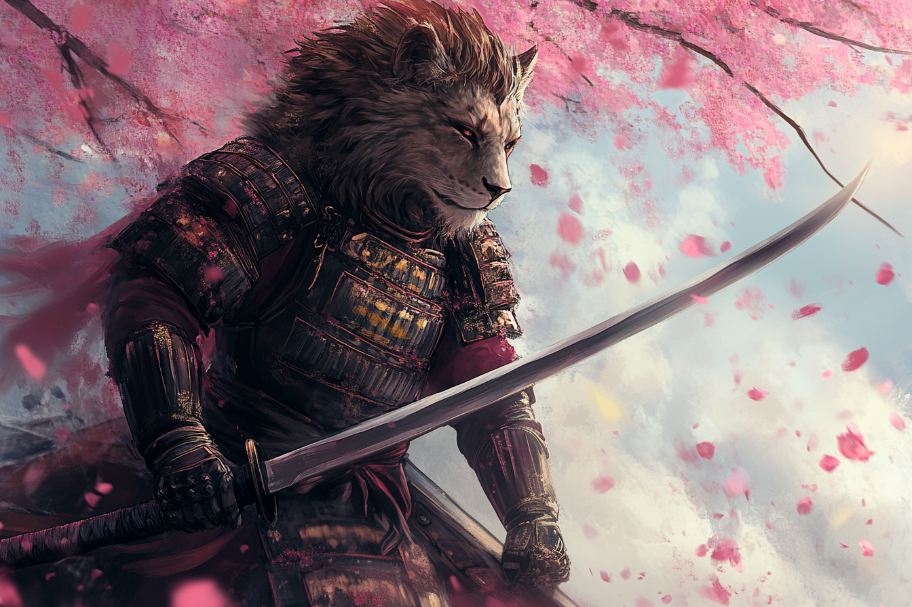

# Caproch

## Présentation
Cette ville a originellement était fondée par des **Léonins**, et cela se constate encore aujourd'hui dans la répartition ethnique. 

A l'origine une fusion de deux tribus, on remarque encore aujourd'hui un héritage culturel témoin de cette fusion. La **première tribu**, très pacifique, qui a très rapidement inventé des procédés de gabrication de papier, qui a profité de cet avantage technologique pour commencer à cartographier ses environs et naviguer efficacement vers d'autres tribus pour forger leur esprit commercial. La **deuxième tribu**, plutôt guerrière, qui s'était spécialisée dans le domptage d'animaux et de la communication avec eux.

C'est non sans mal que ses deux tribus ont joint leurs forces face au défi qu'a été la [Grande Catastrophe](../../WORLDBUILDING/AUTRES/CatastropheMagique.md), tant leur cultures sont différentes. Dès l'apparition des stabilisateurs naturels, ils ont rusé afin de pouvoir vite s'installer dans la région, dans une étroit espace, entre une montagne et un accès à la mer, facile à défendre et avec ouverture sur l'extérieur et accès à des ressources naturelles.

Une fois installés dans la région, et une fois sédentarisés, c'est dans ce contexte que les deux cultures commencèrent à se mélanger de plus en plus, chaque ancienne tribu profitant des progrès technologiques de l'autre et de ses découvertes.

D'une part, la cité a rapidement prospéré, et les grandes familles marchandes ont rapidement pris de l'importance politiquement. On compte plusieurs types de marchandises que les familles de **Caproch** exportent : leurs **livres**, leurs **cartes**, des **tissus** précieux, des **poissons** péchés dans la région, ainsi que de nombreux objets manufacturés à bases de minéraux trouvés dans les montages (**cuivre, argent** et **fer**).

D'autre part, la puissance militaire et la force de frappe des animaux domptés a permis à la ville d'affirmer sa position et de devenir une puissance incontestée et incontestable dans la région, formant alors régulièrement les **guerriers** les plus redoutés de la région.

Le système politique de **Caproch** s'organise autour de ses grandes **Guildes**, qui sont chacune en charge de s'occuper d'un aspect important de l'industrie et de la culture. Chaque **Guilde** peut posséder son propre système de gestion interne, mais elles doivent néanmoins toutes avoir un représentant qui sert de point d'entrée pour toutes les autres. Tout en haut, on retrouve un système bi-céphale, où les **Guildes** doivent désigner un chef **commercial** et un chef **guerrier** pour un mandat de deux ans.

En plus de cela existe une organisation mythique dans la ville, la **Loge des Douze**, qui est une organisation discrète, dont les membres sont élus à vie parmi les hauts dirigeants de la ville, et dont les choix gouvernent la politique interne et externe de **Caproch**. On entre dans la **Loge** uniquement par initiation, et uniquement par introduction formelle. Initialement créée pour servir d'équilibre entre les douze activités de la ville, équitablement répartie entre activité guerrière et activité civile, cette nécessité s'est estompée petit à petit. Jusqu'à aujourd'hui, on peut retrouver l'empreinte de la **Loge** à plusieurs reprises dans la ville, mais seuls les personnes averties sont capables de reconnaître son influence.

## Les Douze Activités Sacrées
Considérées comme les toutes premières activités de la ville, et considérées comme celles dont elle ne peut pas se séparer. Elle sont au nombre de douze, **six** activités civiles et **six** activités militaires, témoins de la fusion entre les deux anciennes tribus.

A chacune de ces activités correspond une guilde, mais ce sont pas les seules guildes existantes.

| Activité | Type | Guilde |
|- |- |- | 
|Le Mystique du Tissage|Civile|Les Tisseurs de la Trame|
|Le Mystique de la Cartographie|Civile|Les Dessinateurs de l'Horizon|
|Le Mystique de la Calligraphie|Civile|Les Plumes d'Argent|
|Le Mystique de la Navigation|Civile|Les Voiles Vagabondes|
|Le Mystique de la Médecine|Civile|Les Doigts Blancs|
|Le Mystique de la Musique|Civile|Les Bardes de l'Âme|
|L'Art du Domptage|Militaire|Les Chevaucheurs du Désert|
|L'Art du Sabre|Militaire|Les Lames Silencieuses|
|L'Art de la Forge|Militaire|Les Forgerons de l'Aube|
|L'Art de l'Encre|Militaire|Les Encreurs de Sang|
|L'Art de la Stratégie|Militaire|Les Architectes de la Guerre|
|L'Art de l'Eveil|Militaire|Les Eveillés|

## Organisation des Guildes

### Le Mystique du Tissage - Les Tisseurs de la Trame
Les **5 Tisserands Supérieurs** sont ceux qui organisent la guilde. Ils sont élus tous les **5 ans** par l'ensemble des tisserands de la guilde.

### Le Mystique de la Cartographie - Les Dessinateurs de l'Horizon
La guilde est dirigée par **le Grand Cartographe**, élu par les plus grands artisans de la guilde, tous les 5 ans.

### Le Mystique de la Calligraphie - Les Plumes d'Argent
La guilde est gérée par le **Grand Scribe**, élu à vie par les 10 calligraphes les plus âgés et encore en activité.

### Le Mystique de la Navigation - Les Voiles Vagabondes
La guilde est dirigée par l'**Amiral**, qui est élu par tous les capitaines de navire, à vie.

### Le Mystique de la Médecine - Les Doigts Blancs
La guilde est dirigée par les **7 Sages**, 7 médecins élus à vie, chacun spécialisé dans un domaine de la médecine.

### Le Mystique de la Musique - Les Bardes de l'Âme
La guilde est dirigée par le **Maestro**, élus par tous les musiciens qui ont déjà au moins composé une symphonie. Le **Maestro** est élu pour 3 ans.

### L'Art du Domptage - Les Chevaucheurs du Désert
La guilde est dirigée par le **Doyen**, élu tous les 6 ans par l'ensemble de la guilde.

### L'Art du Sabre - Les Lames Silencieuses
La guilde est dirigée par le **Maître de l'Acier**, qui arrive à son poste via un combat contre tous les sabreurs qui souhaitent le mettre au défi. N'importe qui peut défier le **Maître** pour essayer de prendre sa place.

### L'Art de la Forge - Les Forgerons de l'Aube
La guilde est dirigée par l'**Ancien**, qui est élu tous les 15 ans, à condition qu'il passe devant l'ensemble de la guilde pour montrer sa technique.

### L'Art de l'Encre - Les Encreurs de Sang
La guilde est dirigée par l'**Artiste**, qui est élu tous les 8 ans par l'ensemble de la guilde.

### L'Art de la Stratégie - Les Architectes de la Guerre
La guilde est dirigée par le **Grand Stratège**, qui est choisi par son prédécesseur, pour un mandat de 4 ans.

### L'Art de l'Eveil - Les Eveillés
La guilde est dirigée par le **Maître Eveillé**, désigné lors d'un combat organisée par la guilde, tous les 9 ans.

## La Loge des Douze
La **Loge des Douze** est une organisation discrète de **Caproch** qui a vue le jour autour des [Douze Activités Sacrées](#les-douze-activités-sacrées). 

La plupart des décisions impactantes de **Caproch** sont prises de façon **collégiales** au sein de cette organisation, qui a réussi à infiltrer la plupart des guildes de la ville et les hautes institutions.

Les membres des **Loge des Douze** sont élus à vie parmi les hauts dirigeants de la ville, et leurs choix gouvernent la politique interne et externe de **Caproch**. On entre dans la **Loge** uniquement par initiation, et uniquement par introduction formelle. 

Initialement créée pour servir d'équilibre entre les douze activités de la ville, équitablement répartie entre activité guerrière et activité civile, cette nécessité s'est estompée petit à petit. Jusqu'à aujourd'hui, on peut retrouver l'empreinte de la **Loge** à plusieurs reprises dans la ville, mais seuls les personnes averties sont capables de reconnaître son influence.

On retrouve au sein de la **Loge** au un membre qui est spécialisé dans chaque activité sacrée de la ville. Chacun de ces membres a une place spéciale dans la **Loge**.

## Seigneurs guerrier et commercial
Il existe deux seigneurs à **Caproch**, qui sont élus par l'ensemble des **Guildes** par consensus si possible, par élection si nécessaire. Historiquement, cette distinction est liée à la fusion des deux clans qui ont fusionné pour former ce qui allait devenir le clan qui s'installera à **Caproch** après la [**Grande Catastrophe**](../AUTRES/CatastropheMagique.md).

Il existe un **Seigneur Commercial**, qui règne sur toutes les activités civiles et commerciales de la ville, et qui prend toutes les décisions liées à la gestion extérieure de la ville.

D'autre part, il y a le **Seigneur Guerrier**, qui règne sur toutes les activités guerrières de la ville, et qui prend toutes les décisions liées à l'exploration et à l'activité militaire.

En pratique, c'est la [Loge des Douze](#la-loge-des-douze) qui en secret choisit les seigneurs commercial et guerrier et qui impose son choix au reste des guilde via ses membres qui les ont infiltrées. De facto, les deux seigneurs sont donc des **membres** de la **Loge**.

Les deux seigneurs sont également en charge d'organiser toutes les institutions de la ville qui ne sont gérées par aucune guilde.

### Seigneur Commercial - [Chul-Moo Kwon](../PERSONNAGES/CAPROCH/ChulMooKwon.md)

### Seigneur Guerrier

## Exploration et expéditions
Les habitants de **Caproch** s'appuient beaucoup sur l'exploitation des ressources proches de leur ville, et mènent parfois des expéditions dans des régions arides, voires désertiques. Ils se servent alors de **cristaux** qu'ils transportent sur le dos afin de ne pas se déshydrater en magie.

Parmi les ressources que ramènent les explorateurs des confins du désert à l'Est et des montagnes, on retrouve : 
* Des métaux comme du **fer**, **cuivre**, **argent** et **or** ;
* Des métaux précieux comme de l'[**Orichalque**](../ESPECES/Especes_Minerales.md#orichalque), extrait du désert ;
* Cristaux d'éther ;
* Plantes rares, dont hallucinogènes et curatives ;

## Insufflation magique
Les habitants de **Tchevo** ont réussi à maîtriser l'insufflation de magie dans leurs corps afin de devenir plus puissant momantanément. L'invocation de cette magie passe souvent par de l'automutilation car cette magie passe plus facilement à travers le système sanguin. Ils rentrent alors généralement dans une rage folle.

On appelle les guerriers qui réussissent à arriver à ce stade les **Ketsuma**, à ne pas confondre avec les membres de la guilde de l'**Art de l'Eveil**.

Ces transformations sont vues comme un appel aux dieux et aux esprits anciens des tribus fondatrices, ainsi que des anciens **Ketsuma**.

## Montures géantes
Les habitants de Tchevo utlisent généralement des montures géantes, des reptiles, avec lesquelles ils communiquent magiquement via des tatouages sur le monteur et la monture.

## Avant-poste dans le désert
[TODO] : Autour de stabilisateurs naturels désetiques

