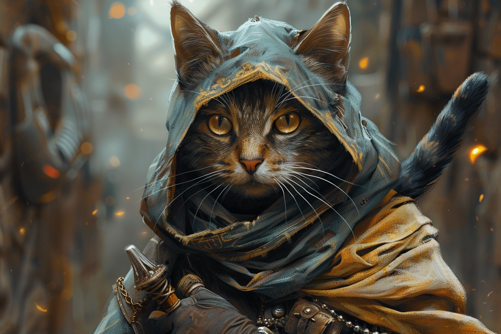
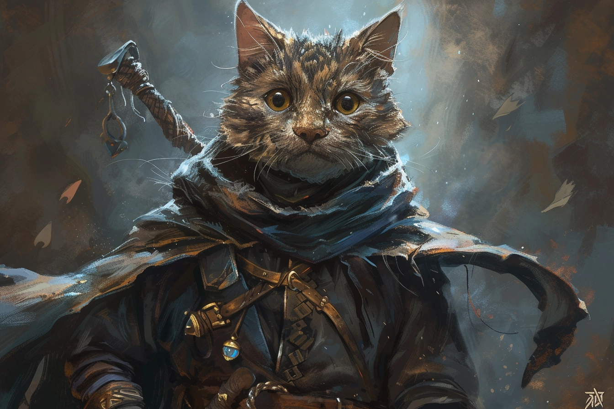
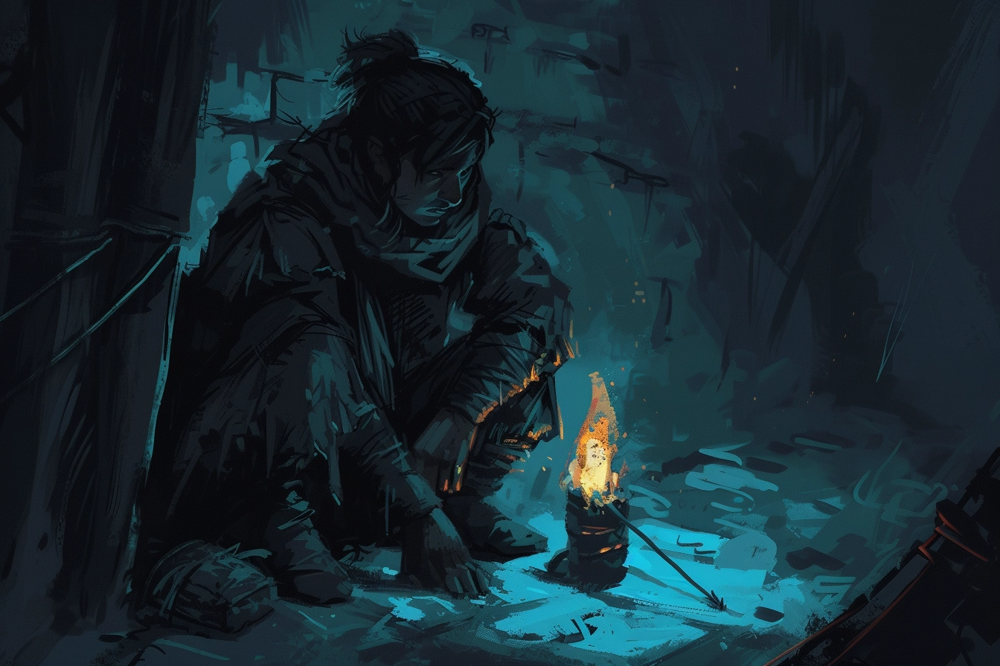

# Dvolsti

## Présentation
**Dvolsti** est un petite ville située non loin de Rovtal, étant son vassal. Par rapport à **Rovtal**, Dvolsti est relativement récente : elle a été créée autour d'un stabilisateur artificiel de leyline, et le besoin de la création de cette ville s'est fait sentir suite à l'expansion de Rovtal.

Située sur la rive droite du fleuve, **Dvolsti** reste quand même connectée à sa ville mère via un pont, et s'excentre un peu afin de profiter à la fois des ressources fluviaales et d'avantage d'espace pour s'étendre sur l'autre rive. Ville relativement modeste en taille et au niveau pécunier, la différence d'ambiance se fait sentir avec Rovtal, qui est *de facto* la capitale : les rues sont plus spacieuses, mais moins bien entretenues, la population est plus pauvre. Une source de revenus certain reste **Blanchécum** qui se trouve en aval, et qui est considérée comme *la* ville de villégiature par excellence de Rovtal. 

Dans ce climat, il a été normal de voir apparaître deux organisations pour laquelle **Dvolsti** est connue : 
* **L'école de cuisine**, qui profite de l'abondance des ressources avoisinantes. Les meilleurs cuisiniers vont ensuite travailler dans les villes voisines, **Blanchécum** se réservant les meilleurs parmi les meilleurs ; 
* **Les Enfants de la Rue**, organisation criminelle tentaculaire, qui sévit dans la région et qui est basée quelque part dans la ville.

En plus de **Muhuta** et **Italis** qui sont vénérés dans **Rovtal**, le culte de **Kscrucius** est assez commun dans la ville. **Kscrucius**, dieu de la Discipline et de la Douleur, représente une lueur d'espoir dans la vie des habitants de **Dvolsti**, qui estiment que leur situation moins aisée est une souffrance à endurer avant de pouvoir gravir les échelons et un jour pouvoir vivre mieux.

Les **Enfants de la Rue** sont des adeptes de ce crédo, estimant que leur vie plus que modeste n'est qu'une autre épreuve qu'ils doivent endurer et que c'est grâce à leur investissement qu'ils réussiront un jour à s'en sortir. Pendant ce temps, il leur semble logique et juste de faire ce qui leur permet de survivre, quitte à ce que des inconnus en souffrent.

## PNJ 

### Les Enfants de la Rue 

### Minno - Novice

* Nom : **Minno**
* Âge : **17 ans**
* Espèce : **Felicis** (M)
* Alignement : **Chaotic Neutral**
* MBTI : **INTP**
* Filiations : **Enfants de la Rue** (novice)
* Description : 
    * Furtif et de nature méfiante envers tout le monde, il est souvent avec son amie [Fééli](#fééli---novice)
---

### Fééli - Novice

* Nom : **Fééli**
* Âge : **18 ans**
* Espèce : **Felicis** (F)
* Alignement : **Chaotic Evil**
* MBTI : **ENFP**
* Filiations : **Enfants de la Rue** (novice)
* Description : 
    * Espiègle malgré tout, elle traîne toujours avec son ami de toujours, [Minno](#minno---novice)
---

### Grégwa Uut - Membre

* Nom : **Grégwa Uut**
* Âge : **27 ans**
* Espèce : **Humain**
* Alignement : **True Neutral**
* MBTI : **ISTJ**
* Filiations : **Enfants de la Rue** (membre)
* Description : 
    * Il a réussi à faire ses preuves récemment au sein des Enfants de la Rue, il a la tâche de surveiller les quelques novices sous ses ordre, dont [Minno](#minno---novice) et [Fééli](#fééli---novice).
    * Il a rejoint les **Enfants de la Rue** parce qu'il voulait sortir de la pauvreté. 
    * Il a été recruté par quelqu'un de plus ancien et plus gradé que lui, et ne sait donc pas grand chose de l'organisation en elle-même.
    
---