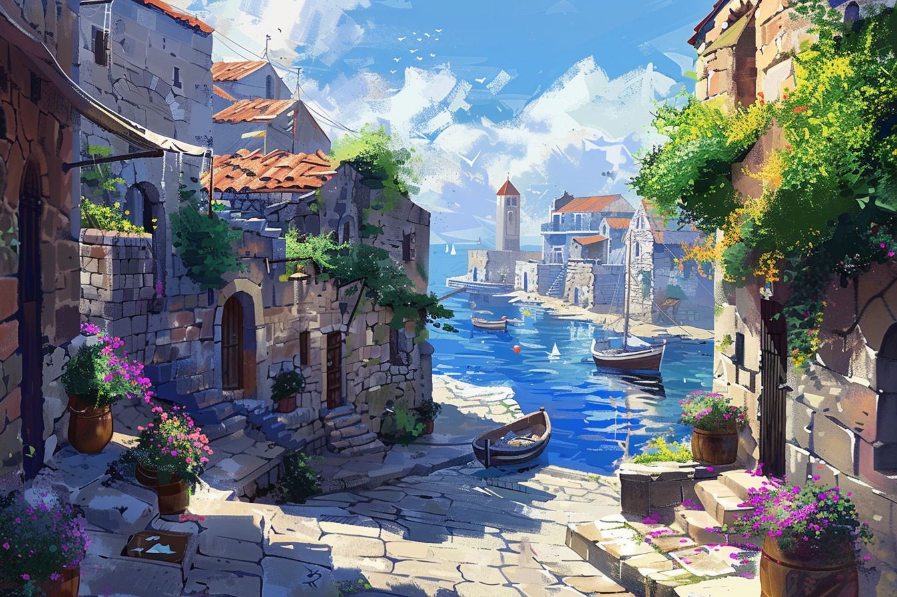
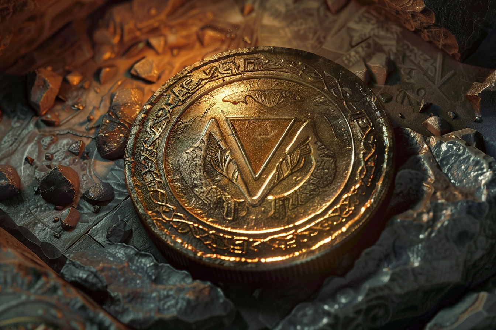

# Dvolsti

## Présentation

**Dvolsti** est un petite ville située non loin de Rovtal, étant son vassal. Par rapport à **Rovtal**, Dvolsti est relativement récente : elle a été créée autour d'un stabilisateur artificiel de leyline, et le besoin de la création de cette ville s'est fait sentir suite à l'expansion de Rovtal.

Située sur la rive droite du fleuve, **Dvolsti** reste quand même connectée à sa ville mère via un pont, et s'excentre un peu afin de profiter à la fois des ressources fluviales et d'avantage d'espace pour s'étendre sur l'autre rive. Ville relativement modeste en taille et au niveau pécunier, la différence d'ambiance se fait sentir avec Rovtal, qui est *de facto* la capitale : les rues sont plus spacieuses, mais moins bien entretenues, la population est plus pauvre. Une source de revenus certain reste **Blanchécum** qui se trouve en aval, et qui est considérée comme *la* ville de villégiature par excellence de Rovtal. 

Dans ce climat, il a été normal de voir apparaître deux organisations pour laquelle **Dvolsti** est connue : 
* **L'école de cuisine**, qui profite de l'abondance des ressources avoisinantes. Les meilleurs cuisiniers vont ensuite travailler dans les villes voisines, **Blanchécum** se réservant les meilleurs parmi les meilleurs ; 
* **Les Enfants de la Rue**, organisation criminelle tentaculaire, qui sévit dans la région et qui est basée quelque part dans la ville.

En plus de **Muhuta** et **Italis** qui sont vénérés dans **Rovtal**, le culte de **Kscrucius** est assez commun dans la ville. **Kscrucius**, dieu de la Discipline et de la Douleur, représente une lueur d'espoir dans la vie des habitants de **Dvolsti**, qui estiment que leur situation moins aisée est une souffrance à endurer avant de pouvoir gravir les échelons et un jour pouvoir vivre mieux.

Les **Enfants de la Rue** sont des adeptes de ce crédo, estimant que leur vie plus que modeste n'est qu'une autre épreuve qu'ils doivent endurer et que c'est grâce à leur investissement qu'ils réussiront un jour à s'en sortir. Pendant ce temps, il leur semble logique et juste de faire ce qui leur permet de survivre, quitte à ce que des inconnus en souffrent.

## Lieux 

### Manoir d'[Arkolapoulous](../PERSONNAGES/ENFANTS_DE_LA_RUE/Arkolapoulos_Prunos.md)
**Arkolapoulos** est sans doute la personne la plus riche de la ville. Son manoir, qui se situe en bordure de la ville et loins des quartiers sensibles, est sans doute la plus belle demeure de la région. 

### Olives et Sardines
L'entreprise la plus prospère de toute la ville est **Olives et Sardines**, entreprise créée et dirigée par **Arkolapoulos**. Elle a plusieurs entrepots en ville, des ports de pêches, et des oliveraies plantés dans la région.. Elle détient les plus gros stands sur la place de marché de la ville et exporte partout dans la région.

### La *Taverne Familiale*
La **Taverne Familiale** est un très grand local, réaménagé par la société d'**Arkolapoulos**, où se réunissent régulièrement l'ensemble des personnes trop pauvres pour subvenir à leurs besoins afin de manger les plats offerts par l'entreprise.

On y mange souvent des plats à base d'huile d'olive et de sardines, étant les deux produits principaux de l'entreprise d'**Arkolapoulos**.

Plusieurs cusiniers en étude ou diplômés de [l'école du couteau affûté](#lécole-du-couteau-affûté) participent à la préparation des plats régulièrement. Ils sont cependant souvent mal vus par leurs pairs.

### L'école du couteau affûté
Pôle d'attractivité majeur, **l'école du couteau affûté** est l'école de cuisine la plus connue de toute la région. Profitant de produits de qualité locaux (notamment ceux de [Rovtal](./Rovtal.md) et de [Brumebourg](./Brumebourg.md)), elles est *de facto* l'école où se forment toutes les cuisiniers les plus renommés, qui sont ensuite employées par les grandes maisons nobles de **Rovtal**.

### La Place du Marché (La Place Dum)
Au coeur de la ville, la **place du marché**, aussi la **Place Dum**, est l'endroit où se rassemblent l'ensemble des commerçant de la ville et d'ailleurs afin de vendre l'ensemble de leurs produits. 

Parmi les stands les plus connus, on retrouve notamment ceux de [**Olives et Sardines**](#olives-et-sardines), des stands tenus par les cuisiniers encore en formation, et certains marchands venus de **Brumebourg**. On y croise souvent des acheteurs venus de [**Blanchécum**](./Blanchécum.md) afin de rapporter des produits de qualité à leur maîtres.

## Quartiers

### Quartier Nord - Le quartier du port de commerce

### Quartier Est - Le quartier résidentiel

### Quartier Ouest - Le quartier du marché

### Quartier Sud - Le quartier du port de pêche

### Quartier Central - Le quartier administratif

## Événements marquants

## Personnages importants de la ville

### [Arkolapoulos Prunos](../PERSONNAGES/ENFANTS_DE_LA_RUE/Arkolapoulos_Prunos.md)
Plus grand entrepreneur de la ville, il est vu de tous comme étant la personne la plus gentille, serviable et généreuse de la ville.

### Les magiciens des quartiers de la ville
Autrefois tous amis, ce groupe de magiciens s'est chamaillé, si bien qu'ils ont tous décidé de s'exiler dans un des quartiers de la ville, ne se partageant pas la clientèle. 

On nomme : 
* [Serdj Hichééz](../PERSONNAGES/DVOLSTI/Serdj_Hichééz.md), situé au Quartier Nord ;
* [Krista Békar](../PERSONNAGES/DVOLSTI/Krista_Békar.md), située au Quartier Sud ;
* [Ioannis Krel](../PERSONNAGES/DVOLSTI/Ioannis_Krel.md), situé au Quartier Est ;
* [Hafez Luxor](../PERSONNAGES/DVOLSTI/Hafez_Luxor.md), situé au Quartier Ouest.

## Les Enfants de la Rue 

### Résumé

Organisation criminelle hautement hiérarchique, les novices et simples membres sont généralement recrutés das la rue et ne sont que très rarement informés des plans qui s'élaborent par leurs supérieurs. 

L'ensemble des membres hautement positionnés portent sur eux un insigne : **une pièce marqué de l'emblème des Enfants de la Rue** (un triangle inversé).

Les membres les plus bas hiérarchiquement sont souvent considérés comme une simple ressource qui peut s'acquérir, typiquement en proposant du travail aux jeunes dans la rue, d'où le nom de l'organisation.

Les membres en dessous de **Chef de groupe** s'appellent souvent avec des noms fraternels entre eux, mais ce n'est pas le cas des membres les plus haut gradés, avec qui l'aspect familial n'accroche pas conceptuellement.

### Hiérarchie
* Novice 
* Membre
* Chef de groupe
* Chef de division 
* Leader

### Activités criminelles
Parmi toutes les activités illégales des Enfants de la Rue, on retrouve : 
* **Trafic de cristaux magiques**, activité la plus lucrative. Les cristaux, qui ont fait tout le trajet depuis [Caproch](./Caproch.md) sont récupérés depuis les ports de [Blanchécum](./Blanchécum.md) avant d'être revendus aux plus offrants pour les plus gros, et dans la rue pour les cristaux de piètre qualité.
* **Trafic d'animaux**, activité quasiment intégralement justifiée par la proximité avec [Blanchécum](./Blanchécum.md), où les animaux les plus exotiques sont vendus à des prix exorbitants.
* **Trafic de personnes**, les espèces les plus rares (centaures, avemains) sont souvent kidnappées très jeunes pour être revendues à des nobles peu scrupuleux.
* **Prêts usuriers**, certaines personnes incapables de payer les intérêts de leurs prêts peuvent en payer le prix par leur vie.

### Divisions
L'organisation est séparée en plusieurs groupes, appelés **divisions**, chacune ayant sa spécialité.

#### Division Armée
Cette **division** s'occupe d'intervenir sur le terrain et de mener les missions offensives à bien.

Le **chef de division** est [**Bakari Phéroh**](../PERSONNAGES/PNJ/EnfantsDeLaRue.md#bakari-phéroh---chef-de-division).

#### Division des Renseignements
Cette **division** s'occupe d'infiltrer l'ensemble des cibles de l'organisation et de récupérer toute information jugée cruciale pour mener les missions à leur terme.

Les **chefs de division** sont les frère et soeur [**Griffes-Rouges**](../PERSONNAGES/PNJ/EnfantsDeLaRue.md#griffes-rouges---cheffe-de-division) et [**Paumes-Bleues**](../PERSONNAGES/PNJ/EnfantsDeLaRue.md#paumes-bleues---chef-de-division).

#### Division Logistique 

Cette **division** s'occupe de recruter les nouveaux membres, approvisionner les troupes en matériel et de revendre tous les objets volés.

La **chef de division** est [**Elvira Phrodita**](../PERSONNAGES/PNJ/EnfantsDeLaRue.md#elvira-phrodita---cheffe-de-division).

#### Etat-Major 

Ce groupe comprend l'ensemble des membres les plus hauts placés dans la hiérarchie de l'organisation : les chefs de division, le leader, et les membres proches du leader.

Le leader de l'organisation est [**Arkolapoulos Prunos**](../PERSONNAGES/PNJ/EnfantsDeLaRue.md#arkolapoulos-prunos---leader).
