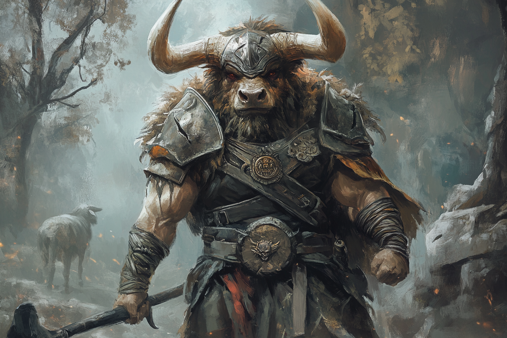

# Ingar

**Ingar** est un ville dans laquelle siège toute une hiérarchie de Minotaures, dont le mode de vie est basé sur les raids des régions environnantes.

La ville est située près de la mer et est prise dans une brume quasi-constante.

C'est une militocratie, où c'est toujours les plus forts qui ont le dernier mot.

Ils vénèrent quasiment tous les déité [Ingar](../COSMOLOGIE/PLANS_ET_DIVINITES/Ingar.md).

