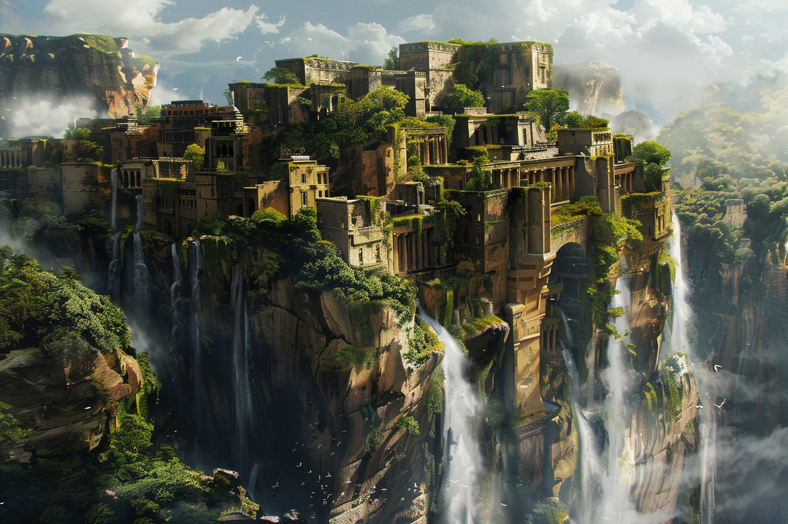
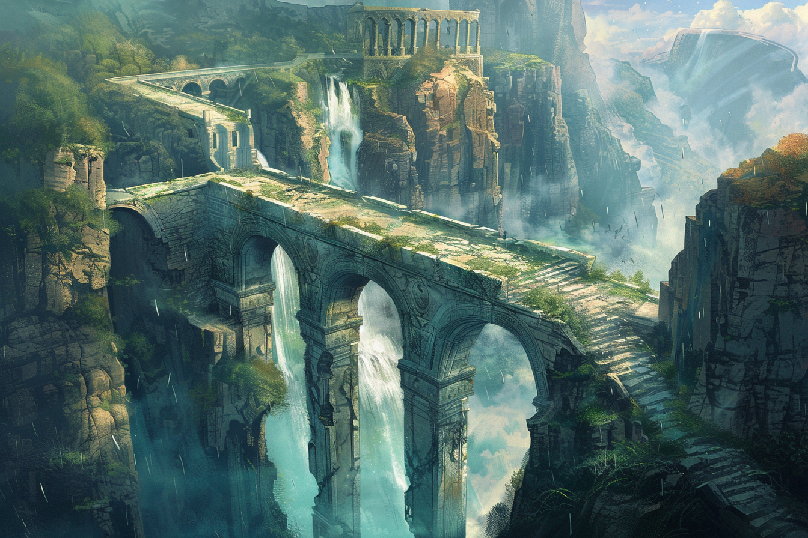

# Rovtal

## Présentation
**Rovtal** est une ville fondée par une ancienne tribu composée de **Sauriens** et de **Varanides**. Autrefois, cette tribu était connue pour ses performances au niveau de l'agriculture, ayant combiné habilement magie et culture afin de pouvoir se sustenter. 

C'est donc avec joie que cette tribu s'est installée dans cette zone lors de l'apparition des stabilisateurs naturels, puisque l'Ouest de la Côte Épineuse est connue de nos jours pour ses terres fertiles et argileuses, et son exposition au soleil. Parmi toutes les cultures différentes, on trouve notamment : des agrumes, des vignes pour la fabrication du vin, des légumes et fruits charnus et juteux, ainsi que des baies de toutes sortes.

De plus, les cultivateurs de Rovtal usent fréquemment de la magie afin de s'occuper au mieux de leurs cultures, de changer leurs tailles et leur goût, et même de les faire changer de couleur et de texture pour les mets les plus raffinés et exotiques. Pour cela, ils invoquent les magies des deux dieux les plus populaires de la ville : **Muhuta**, déesse de la Transfrmation et du Renouveau, et **Italis**, dieu de la Vie et de la Mort. 

Le temps passant, la ville s'est agrandie et hiérarchisée. Les terrains cultivés se faisant de plus en plus grands, les savants de Rovtal ont dû trouver un moyen de stabiliser les leylines à une grande distance de leur centre-ville, organisé autour du stabilisateur naturel. Les stabilisateurs artificiels étant inventés, ils en placèrent de plus en plus loin afin de conquérir un territoire plus grand, ce qui a rapidement nécessité une organisation efficace. De nos jours, un seigneur reigne sur Rovtal, et il mandate des représentants dans les villes aux alentours afin de gérer localement les villages. 

Malgré la prévalence des cultes de **Italis** et **Muhuta**, d'autres cultes existent dans Rovtal, mais leurs traditions et croyances sont moins connues du grand public. On citera notamment le culte de **Komorath**, dieu de la Tromperie et des Arts Obscurs, qui se font appeler les **Sombres Peintres**, qui voient d'un mauvais oeil l'expansion toujours constante de la ville, prêchant que la stabilité ne peut engendrer que la ruine. Dans le secret, ce culte comprend des **Sombraurs** en son sein, des créatures se nourissant de la magie d'autrui pour survivre, créatures qui ont été créées (et qui le sont toujours) via un long rituel à la gloire de **Komorath**. Dans l'imaginaire des **Peintres** et des **Sombraurs** : le Chaos mène à la Liberté, la Liberté mène à l'Art, l'Art mène au Plaisir.

## Lieux 
### La guilde des ingénieurs

### L'Ecole des Mages

### Maison de la [Famille Sfer](../PERSONNAGES/ROVTAL/GROUPES/Famille_Sfer.md)

## Les Sombres Artistes
Culte de [**Komorath**](../COSMOLOGIE/PLANS_ET_DIVINITES/Komorath.md).

## Événements marquants
* **95** : Arrivée de [Federi Gox](../PERSONNAGES/SOMBRES_ARTISTES/Federi_Gox.md), [Alvaro Shenzi](../PERSONNAGES/SOMBRES_ARTISTES/Alvaro_Shenzi.md) et [Maria Ufassa](../PERSONNAGES/SOMBRES_ARTISTES/Maria_Ufassa.md).

## Traditions et particularités

## Personnages importants de la ville

### La famille royale
* [Famille Andreadis](../PERSONNAGES/ROVTAL/GROUPES/Famille_Andreadis.md)

### Les familles nobles
* [Famille Sfer](../PERSONNAGES/ROVTAL/GROUPES/Famille_Sfer.md)
* [Famille Kutt](../PERSONNAGES/ROVTAL/GROUPES/Famille_Kutt.md)
* [Famille Alexandros](../PERSONNAGES/ROVTAL/GROUPES/Famille_Alexandros.md)
* [Famille Botzaris](../PERSONNAGES/ROVTAL/GROUPES/Famille_Botzaris.md)
* [Famille Zografos](../PERSONNAGES/ROVTAL/GROUPES/Famille_Zografos.md)

### Les familles prestigieuses
* [Famille Kwestyon](../PERSONNAGES/ROVTAL/GROUPES/Famille_Kwestyon.md)
* [Famille Andreou](../PERSONNAGES/ROVTAL/GROUPES/Famille_Andreou.md)
* [Famille Lambrakis](../PERSONNAGES/ROVTAL/GROUPES/Famille_Lambrakis.md)
* [Famille Petrakos](../PERSONNAGES/ROVTAL/GROUPES/Famille_Petrakos.md)
* [Famille Giannaris](../PERSONNAGES/ROVTAL/GROUPES/Famille_Giannaris.md)

## Images
### Surface

### Flancs

### Tréfonds

### Intérieurs

### Lieux spéciaux

### Personnes

