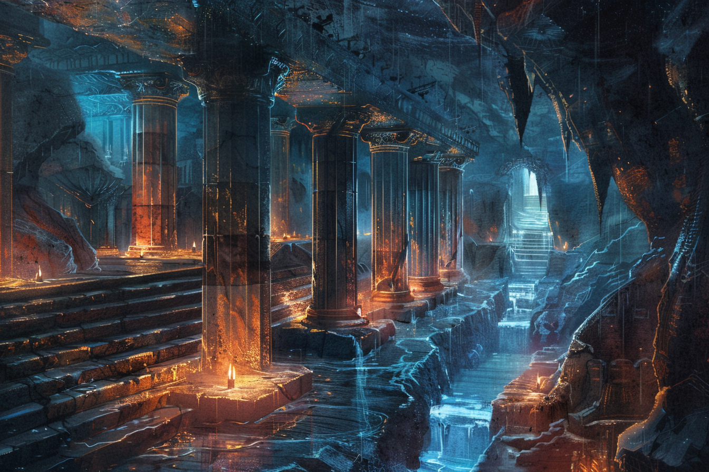

# Rovtal

## Présentation
**Rovtal** est une ville fondée par une ancienne tribu composée de [**Sauriens**](../ESPECES/Especes_Conscientes.md#sauriens) et de [**Varanides**](../ESPECES/Especes_Conscientes.md#varanides). Autrefois, cette tribu était connue pour ses performances au niveau de l'agriculture, ayant combiné habilement magie et culture afin de pouvoir se sustenter. 

C'est donc avec joie que cette tribu s'est installée dans cette zone lors de l'apparition des stabilisateurs naturels, puisque l'Ouest de la Côte Épineuse est connue de nos jours pour ses terres fertiles et argileuses, et son exposition au soleil. Parmi toutes les cultures différentes, on trouve notamment : des agrumes, des vignes pour la fabrication du vin, des légumes et fruits charnus et juteux, ainsi que des baies de toutes sortes.

La ville de **Rovtal** est néanmoins particulière puisque le **stabilisateur de leyline naturel** se trouve au fond d'un énorme gouffre qui s'étend sur une très grande distance. De nos jours, la **vieille ville** se situe au fond du gouffre, alors que les nouveaux bâtiments se construisent tous en surface de ce gouffre. Devant cette expansion, il a été fait le choix de délocaliser les familles non prestigieuses vers la [Surface](#surface), laissant les [Tréfonds](#tréfonds) aux familles les plus influentes.

Au niveau de l'agriculture, les agriculteurs de Rovtal usent fréquemment de la magie afin de s'occuper au mieux de leurs cultures, de changer leurs tailles et leur goût, et même de les faire changer de couleur et de texture pour les mets les plus raffinés et exotiques. Pour cela, ils invoquent les magies des deux dieux les plus influents de la ville : [**Muhuta**](../COSMOLOGIE/PLANS_ET_DIVINITES/Muhuta.md), déesse de la **Transformation** et du **Renouveau**, et [**Italis**](../COSMOLOGIE/PLANS_ET_DIVINITES/Italis.md), dieu de la **Vie** et de la **Mort**. 

Le temps passant, la ville s'est agrandie et hiérarchisée. Les terrains cultivés se faisant de plus en plus grands, les savants de Rovtal ont dû trouver un moyen de stabiliser les leylines à une grande distance de leur centre-ville, organisé autour du [stabilisateur naturel](#le-stabilisateur-naturel). Les stabilisateurs artificiels étant inventés, ils en placèrent de plus en plus loin afin de conquérir un territoire plus grand, ce qui a rapidement nécessité une organisation efficace. De nos jours, un **seigneur** reigne sur Rovtal, et il mandate des représentants dans les villes aux alentours afin de gérer localement les villages. 

Malgré la prévalence des cultes de **Italis** et **Muhuta**, d'autres cultes existent dans Rovtal, mais leurs traditions et croyances sont moins connues du grand public. On citera notamment le culte de [**Komorath**](../COSMOLOGIE/PLANS_ET_DIVINITES/Komorath.md), dieu de la Tromperie et des Arts Obscurs, dont certains membres se font appeler les [**Sombres Artistes**](#les-sombres-artistes). Dans le secret, ce culte est dirigé par des [**Sombraurs**](../ESPECES/ESPECES_MAGIQUES/Sombraur.md), des créatures se nourissant de la magie d'autrui pour survivre, créatures qui ont été créées (et qui le sont toujours) via un long rituel à la gloire de **Komorath**. Ces **Sombraurs**, dirigés par [**Federi Gox**](../PERSONNAGES/SOMBRES_ARTISTES/Federi_Gox.md), aidé par le seigneur local [**Ethérios Sfer**](../PERSONNAGES/SOMBRES_ARTISTES/Ethérios_Sfer.md), tirent en réalité les ficelles derrière beaucoup des mouvements politiques de la région.

## Système politique
Le **système politique** est la féodalité : un famille royale, la [famille Andreadis](../PERSONNAGES/ROVTAL/GROUPES/Famille_Andreadis.md), règne sur **Rovtal** et sur toutes les villes vassales, tandis que les familles prestigieuses de la ville aident la famille royale à gouverner le royaume.

Politiquement, **Rovtal** fait la distinction entre familles **nobles** et familles **prestigieuses**. Là où les familles **nobles** gèrent les activités les plus cruciales de la ville et ont leur mot à dire sur sa gestion lors des [hauts conseils](#hauts-conseils), les familles **prestigieuses** sont moins influentes et sont plutôt vues comme les gestionnaires les plus compétents.

### Familles nobles
On compte **cinq** familles nobles :
* [Famille Sfer](../PERSONNAGES/ROVTAL/GROUPES/Famille_Sfer.md), représentée par [Ethérios Sfer](../PERSONNAGES/SOMBRES_ARTISTES/Ethérios_Sfer.md), en charge de la **politique extérieure**.
* [Famille Kutt](../PERSONNAGES/ROVTAL/GROUPES/Famille_Kutt.md), représentée par [Timotheos Kutt](../PERSONNAGES/ROVTAL/Timotheos_Kutt.md), en charge de l'**armement**.
* [Famille Alexandros](../PERSONNAGES/ROVTAL/GROUPES/Famille_Alexandros.md), représentée par [Kroisos Alexandros](../PERSONNAGES/ROVTAL/Kroisos_Alexandros.md), en charge des **finances et des impôts**.
* [Famille Botzaris](../PERSONNAGES/ROVTAL/GROUPES/Famille_Botzaris.md), représentée par [Androkles Botzaris](../PERSONNAGES/ROVTAL/AndroklesBotzaris.md), en charge de la [**Guilde des Ingénieurs**](#la-guilde-des-ingénieurs).
* [Famille Zografos](../PERSONNAGES/ROVTAL/GROUPES/Famille_Zografos.md), représentée par [Theofania Zografos](../PERSONNAGES/ROVTAL/ThoefaniaZografos.md), en charge de l'[Ecole d'Ethérologie](#lecole-dethérologie).

### Familles prestigieuses
On compte **cinq** familles prestigieuses :
* [Famille Kwestyon](../PERSONNAGES/ROVTAL/GROUPES/Famille_Kwestyon.md)
* [Famille Andreou](../PERSONNAGES/ROVTAL/GROUPES/Famille_Andreou.md), représentée par [Olympia Andréou](../PERSONNAGES/ROVTAL/Olympia_Andréou.md), en charge des **imports et des exports**.
* [Famille Lambrakis](../PERSONNAGES/ROVTAL/GROUPES/Famille_Lambrakis.md), représentée par [Konstantia Lambrakis](../PERSONNAGES/ROVTAL/KonstantiaLambrakis.md), en charge de la gestion du culte de [**Muhuta**](../COSMOLOGIE/PLANS_ET_DIVINITES/Muhuta.md).
* [Famille Petrakos](../PERSONNAGES/ROVTAL/GROUPES/Famille_Petrakos.md)
* [Famille Giannaris](../PERSONNAGES/ROVTAL/GROUPES/Famille_Giannaris.md), représentée par [Xaverios Giannaris](../PERSONNAGES/ROVTAL/XaveriosGiannaris.md), en charge de la gestion du culte d'[**Italis**](../COSMOLOGIE/PLANS_ET_DIVINITES/Italis.md).

### Hauts Conseils
Les **Hauts Conseils** sont la plus haute instance politique à **Rovtal**.

Réunissant un représentant de chaque famille noble, ainsi que plusieurs membres de la famille royale, il est l'endroit où se font toutes les décisions touchant l'ensemble du territoire et l'ensemble des activités de la ville.

Par défaut, il y a un **Haut Conseil** tous les deux mois, mais n'importe lequel des membres peut faire se réunir le conseil en cas d'urgence.

Actuellement, les membres du **Haut Conseil** sont :
* [Astrée **Andreadis**](../PERSONNAGES/ROVTAL/Astrée_Andreadis.md) pour la famille royale ;
* [Etherios **Sfer**](../PERSONNAGES/SOMBRES_ARTISTES/Ethérios_Sfer.md) ; 
* [Timotheos **Kutt**](../PERSONNAGES/ROVTAL/Timotheos_Kutt.md) ;
* [Kroisos **Alexandros**](../PERSONNAGES/ROVTAL/Kroisos_Alexandros.md) ;
* [Androkles **Botzaris**](../PERSONNAGES/ROVTAL/AndroklesBotzaris.md) ;
* [Theofania **Zografos**](../PERSONNAGES/ROVTAL/ThoefaniaZografos.md). 

## Lieux 
### La guilde des ingénieurs

La **Guilde des Ingénieurs**, située au point le plus bas de la **Surface**, abrite tous les esprits pratiques les plus affûtés de la ville. Gérée par la famille [Botzaris](../PERSONNAGES/ROVTAL/GROUPES/Famille_Botzaris.md).

La **Guilde** a travaillé dans les plus gros projets urbains de la ville, comme notamment :
* **Pont du Détroit** : A nécessité l'utilisation de la magie pour tout stabiliser lors de la construction des piles et certaines fondations ;
* **Système d'Ascenseurs Ethériques** : Ont utilisé les recherches fondamentales de l'**Ecole d'Ethérologie** ;
* **Renforcement des Murs de la Ville**
* (*En cours de construction*) **Réseau de Canalisations Magiques** : Pour les Tréfonds uniquement afin que chaque foyer ait accès à une source magique près de chez soi (nécessite de grosses excavations) ;
* (*En cours de conception*) **Tour de Contrôle des Tempêtes** : Projet visant à contrôler localement la météo.

### L'Ecole d'Ethérologie
L'**Ecole d'éthérologie**, située à la **Surface**, est l'une des principales sources d'attrait de la ville  de **Rovtal**. Plusieurs habitants de la région s'y rendent pour y apprendre plus sur la magie qui a fait la renommée de la ville, ainsi que pour apprendre plus sur les éthers.

L'**Ethérologie** reste une science profondément inscrite dans la **religion**, puisqu'on pense que ce sont les **dieux** qui prête leurs magies aux mortels.

L'entrée de l'école est **libre** pour chacun, l'accès au hall principal est ouvert à tous, et l'amphithéâtre des étudiants débutants est ouvert au public. Les autres lieux demeurent interdits d'accès, mais une autorisation de la part de n'importe quel professeur suffit à y accéder en sa compagnie.

#### Vue de l'extérieur

#### Vue du hall principal

#### Vue de la salle de cours principale

#### Amphithéâtre principal

#### Salle de travaux pratiques

### Le Pont du Détroit

Le **Pont du Détroit** est l'un des premières structures que l'on peut rencontrer en venant à **Rovtal** depuis l'**Est**.

**Rovtal** étant construite autour d'un gouffre, il est assez difficile de descendre dans les **Tréfonds** sans passer par des points de contrôles bien gardés. Vers l'Est, c'est le **Pont du Détroit** qui assure cette position.

Situé un peu en marge de la ville, il est entouré de plusieurs arcades (côté ville), sous lesquelles se trouvent plusieurs étales, qui servent de commerce pour toute personne venant près de la ville sans vouloir y entrer.

Des membres de la garde sont présents près du pont, mais cela n'empêche pas quelque brutes locales, les **Brigands du Détroit**, de sévir, notamment grâce à leur chef [**Edem Kurt**](../PERSONNAGES/ROVTAL/EdemKurt.md), qui n'hésite pas à les corrompre.

### Entrée de la ville - La Porte du Pont

Seule entrée de la ville officielle, orientée pour faire face à l'**Est**. La Porte est ouverte tant que le soleil est levé.

Elle est précédée par le [Pont du Détroit](#le-pont-du-détroit), ce qui constitue une très bonne manière de filtrer les intrus.

### Le Temple d'Italis (Surface)

### Le Temple de Muhuta (Surface)

### Le Temple de Komorath (Surface)

Un prêtre est systématiquement de garde devant le temple, afin de se prémunir des éventuels intrus, car le culte de **Komorath** n'est pas un culte officiel de la ville, ce qui provoque la proflifération de plusieurs détracteurs. Le prêtre-garde a pour habitude de communiquer avec les intrus via des illusions, afin de décourager les plus peureux d'entre eux.

On y retrouve la culture des [mandragores nocturnes](../ESPECES/Especes_Vegetales.md#mandragore-nocture), bien que cela ait été interdit par la ville à cause de leur propriétés narcotiques.

Le temple élève aussi des [colombes de minuit](../ESPECES/Especes_Animales.md#colombe-de-minuit).

### Marché de Rovtal (Surface)

En tant qu'infrastructure de la **Surface**, ce marché, situé non loin du centre de la ville, n'inclut pas les produits d'excellente qualité, généralement accaparés par les riches. Parmi la plupart des produits importés, la quasi-intégralité reste dans les **Tréfonds**.

Le **Marché** est fréquenté par la plupart des habitants de la ville.

### Ascenseurs vers les Tréfonds

Ces ascenseurs sont les seules manières qu'ont les différents habitants de la ville de circuler entre la **Surface** et les **Tréfonds**. En pratique, seules quelques personnes bien choisies parmi les habitants de la **Surafce** peuvent emprunter ces Ascenseurs afin d'aller jusqu'au **Tréfonds**, et sous couvert d'autorisation officielle uniquement ; tandis que les habitants des **Tréfonds**, nobles et membres de familles prestigieuses, peuvent circuler librement.

Plusieurs **Ascenseurs** sont répartis tout autour de la ville, autour des principales failles qui serpentent **Rovtal**, majoritairement vers le centre, dans la mesure où les Tréfonds s'étendent beaucoup moins que la Surface en termes d'aire. Chaque entrée est gardée par un poste de contrôle, qui filtre avec précision les allées et venus de tous les membres de la **Surface**. Le pourtour de chaque poste de garde est protégé par un champ de force afin d'empêcher le passage autre part que par les portes d'entrée et de sortie. 

Les **Ascenseurs** se présentent sous la forme de disques géants, pouvant supporter jusqu'à une vingtaine de personnes en même temps, qui se meuvent le long d'un corridor vertical pendant quelques minutes. La chute dans ce trou béant est mortelle.

### Cristaux de lumière et de chaleur (Tréfonds)

Plusieurs recoins des **Tréfonds** sont généralement sombres et froids, notamment certaines allées creusées à l'intérieure même de la falaise. Afin de pouvoir vivre en tout confort, la plupart des passages de la ville basse sont équipés de **cristaux** permettant de produire lumière et chaleur en quantité suffisante.

### Port de la Faille
Le **Port de la Faille** est le seul port de la ville, situé en **aval** des **Tréfonds**, il permet de rejoindre le fleuve en empruntant la petite rivière qui serpente la ville base. La navigation sur cette rivière permet d'atteindre très rapidement [**Blanchécum**](./Blanchécum.md), qui est la ville par laquelle transite la plupart des marchandises venant des autres villes de la côte, notamment [**Caproch**](./Caproch.md).

Le **Port** est subdivisé en deux parties : une zone réservée pour les marchandises (en aval), et une zone réservée pour les particuliers (en amont). 

Le **Port** est géré par la [famille Andréou](../PERSONNAGES/ROVTAL/GROUPES/Famille_Andreou.md), et particulièrement par [Isabella Andréou](../PERSONNAGES/ROVTAL/Isabella_Andréou.md).

#### Entrée

#### Zone réservée aux particuliers

#### Zone réservée aux marchandises

### Maison de la [Famille Sfer](../PERSONNAGES/ROVTAL/GROUPES/Famille_Sfer.md)

Située dans les **Tréfonds**, c'est le manoir où habitent la quasi-totalité des membres de la famille **Sfer**.

Sous ses airs de maison modeste, la quasi-intégralité de la maison est construite en sous-sol, et les salles qu'elles y abritent sont en réalité immense.

Le sous-sol abrite également la crypte familiale, où sont notamment enterrés l'ensemble de la lignée des [**Ethérios**](../PERSONNAGES/SOMBRES_ARTISTES/Ethérios_Sfer.md).

#### Salle de bal du manoir Sfer

#### Salle des fêtes publiques du Manoir Sfer

Les **cristaux** dans cette salle sont nombreux et disposés au travers de toute la salle. Ils servent à contrôler l'ambiance lumineuse et sonore de la salle lors des fêtes. 

#### Terrasse du Manoir Sfer

#### Crypte du Manoir Sfer

### Manoir de la Famille Alexandros

#### Intérieur

### Le Stabilisateur Naturel

### Le Jardin Royal Cristallin

Le **Jardin Royal Cristallin** sont les jardins qui entourent tout le bâtiment qui abrite le [Stabilisateur Naturel](#le-stabilisateur-naturel).

Toute la végétation du jardin a pris au fur et à mesure des années une teinte violette semblant venir d'un autre monde, probablement sous l'influence du **stabilisateur**.

### Les Thermes du Diamant Bleu

Les **Thermes du Diamant Bleu** sont un lieu de rencontres mondaines dans lesquelles les **Nobles** peuvent aller se détendre en profitant d'un bain chaud. Les **Thermes** se situent un peu en écart de la **ville basse**, ce qui correspond à la bordure du centre-ville de la **Surface**.

La promesse des **Thermes** est de pouvoir requinquer n'importe quelle personne dès qu'elle se plonge à l'intérieur de l'eau. Le processus affiché est l'utilisation de **plantes médicinales**, notamment l'extraction de certains procédés actifs à travers l'emploi de magie.

Les **Thermes** sont officiellement détenues par la [Famille Sfer](../PERSONNAGES/ROVTAL/GROUPES/Famille_Sfer.md), en la personne de [Apolina Sfer](../PERSONNAGES/ROVTAL/ApolinaSfer.md).

En pratique ceci est réalisé en injectant dans l'eau des **Thermes** de l'éther récupéré sur des végétaux.

### Le Cercle d'Ivoire - Club de Combat mondain

Le **Cercle d'Ivoire** est une taverne-restaurant de luxe, réservée aux Nobles puisque se situant dans les Tréfonds, dont l'attraction principale sont les combats qui s'y font au centre de la pièce principale. L'atmosphère est proprice à y passer une soirée à parier sur l'issue des différents combats, et il est possible d'aller s'entretenir avec le barman afin de soumettre son pari.

La plupart des combattants qu'on y retrouve sont des prisonniers en train de **purger leur peine**, qui se voient offrir une réduction du temps qu'ils ont à passer en prison en échange de quelques victoires dans le **Cercle**.

Les **Nobles** et tout visiteur peuvent également prendre part au combat s'ils en ont envie, auquel cas le combattant gagne **5% de la mise totale du combat**.

Les règles des combats sont laissés au choix de l'organisateur, mais la quasi-intégralité des combats se font jusqu'à forfait de l'un des deux combattants, la magie et les armes étant interdite.

Le Cercle organise également l'épreuve du **Grand Chelem**, où il est possible de gagner des pièces d'or supplémentaires si un combattant décide de participer à toute une batterie de combats successivement (toujours à la discrétion de l'organisateur).

Le **Cercle** est géré par la [famille Alexandros](../PERSONNAGES/ROVTAL/GROUPES/Famille_Alexandros.md), plus particulièrement par [Louisa Alexandros](../PERSONNAGES/ROVTAL/LouisaAlexandros.md).

### La Fabrique de Cristaux

La **Fabrique de Cristaux**, située dans les **Tréfonds**, est le seul endroit de la ville à avoir l'autorisation de convertir des cristaux vierges, généralement importés, afin de produire des [cristaux produisant de la lumière ou de la chaleur](#cristaux-de-lumière-et-de-chaleur-tréfonds), ou afin de produire des *sorts de poches*.

La **Fabrique** est gérée par la famille [Zografos](../PERSONNAGES/ROVTAL/GROUPES/Famille_Zografos.md), gérant également l'**Ecole d'Ethérologie**.

La **Fabrique** est en réalité gangrénée par les [**Sombres Artistes**](#les-sombres-artistes), qui se servent de l'endroit pour . Le passage par l'arrière boutique permet d'accéder à un réseau de caves naturelles dans la roche de la falaise avoisinante.

### La Chronique de Rovtal

La **Chronique de Rovtal** est le journal officiel de la ville, qui paraît quotidiennement. Des bureaux sont situés à la **Surface**, et le siège est situé dans les **Tréfonds**.

L'ensemble de l'organisation est géré par la [famille Botzaris](../PERSONNAGES/ROVTAL/GROUPES/Famille_Botzaris.md).

Initialement, le journal servait à communiquer sur l'ensemble des nouvelles infrastructures de la ville, mais a dérivé afin de devenir un journal plus classique qui parle également des mondanités et des nouvelles de la région.

## Les Sombres Artistes

Les **Sombres Artistes** est une organisation qui se cache derrière le culte de [**Komorath**](../COSMOLOGIE/PLANS_ET_DIVINITES/Komorath.md), décrié mais pas secret. Elle se sert de la devanture du culte pour pouvoir agir sans être embêtée.

Derrière cette organisation, se cache les **Mains Noires**, la tête pensante des **Sombres Artistes**, qui sont dans leur intégralité des [**Sombraurs**](../ESPECES/ESPECES_MAGIQUES/Sombraur.md), aussi appelés **Fils-des-Ombres**. L'organisation est née sous l'impulsion de [**Federi Gox**](../PERSONNAGES/SOMBRES_ARTISTES/Federi_Gox.md), le premier **Sombraur**, qui est actuellement en hibernation, afin de recréer l'ancien clan qu'il avait monté, avant la [**Catastrophe Magique**](../AUTRES/CatastropheMagique.md).

Les intentions des **Sombres Artistes** n'est pas très claire. Ils partagent cependant tous une idéologie commune : ils voient dans leur dieu, **Komorath**, une sorte de **sauveur** qui leur donne une raison d'exister au-delà de leur simple individualité.

De nos jours, ils essayent également de développer leur sens de la communauté afin de contrer l'influence des **familles nobles** dans la ville, qui n'a pas grand-chose à faire de la *populace*. Leurs actions servent également à faciliter la vie de leurs **leaders** dans la société.

L'entrée du repaire des **Sombres Artistes** se situe dans l'arrière boutique des [Thermes du Diamant Bleu](#les-thermes-du-diamant-bleu).

## Les Brigands du Détroit
Cette organisation est une bande de voleurs locaux, sévissant près du [Pont du Détroit](#le-pont-du-détroit), qui profitent de l'ignorance de certains visiteurs de la ville pour s'enrichir. 

Ils essaient de rester loin de toute garde près du **Pont**, mais cela ne leur empêche pas de corrompre certains d'entre eux.

Ils sont dirigés par [**Èdem Kurt**](../PERSONNAGES/ROVTAL/EdemKurt.md).

## Événements marquants
* **95** : Arrivée de [Federi Gox](../PERSONNAGES/SOMBRES_ARTISTES/Federi_Gox.md), [Alvaro Shenzi](../PERSONNAGES/SOMBRES_ARTISTES/Alvaro_Shenzi.md) et [Maria Ufassa](../PERSONNAGES/SOMBRES_ARTISTES/Maria_Ufassa.md).
* **162** : Création de l'[**Ecole d'Ethérologie**](#lecole-dethérologie).
* **173** : Invention des **stabilisateurs artificiels** de leyline par la toute naissante [**Ecole d'Ethérologie**](#lecole-dethérologie).

## Traditions et particularités
### La Surface, les Flancs et les Tréfonds

### La Police de Rovtal
La **Police de Rovtal** est l'organisme qui s'occupe de faire régner l'ordre dans la ville. Plusieurs districts existent, et opèrent de façon plus au moins indépendante. Les deux plus grands districts sont :
* Le **District de la Surface** ;
* Le **District des Tréfonds**.

Le **District des Tréfonds** s'occupe quasiment exclusivement des problèmes liés aux nobles.

Le **District de la Surface** abrite la plus grande prison, dans laquelle sont entassés les prisonniers du **District des Tréfonds** également.

La plupart des membres de la police souhaitent être promus pour aller exercer au **District des Tréfonds**.

#### District de la Surface

#### District des Tréfonds

### Fortes inégalités entre les quartiers

**Rovtal** est connu pour être très inégalitaire, et cela se voit lorsqu'on se balade dans les différentes quartiers de la ville.

Les **Tréfonds** sont connus pour être le vieux quartier de la ville et où se trouvent l'ensemble des **familles nobles**, et donc par extension le quartier richer, alors que c'est à la **Surface** où se trouvent les autres individus, notamment les habitants qui ne sont pas originaires de **Rovtal**.

On note également une tension entre tous les cultes qui se pratiquent à **Rovtal**, notamment car les cultes d'[**Italis**](../COSMOLOGIE/PLANS_ET_DIVINITES/Italis.md) et de [**Muhuta**](../COSMOLOGIE/PLANS_ET_DIVINITES/Muhuta.md) peuvent être vus comme étant des cultes de *riches*. Certaines personnes se joignent donc au culte de [**Komorath**](../COSMOLOGIE/PLANS_ET_DIVINITES/Komorath.md), dans l'espoir qu'il soit plus clément.

### Place de l'agriculture dans la ville

## Images
### Surface

### Tréfonds

### Intérieurs

### Lieux spéciaux

### Personnes

