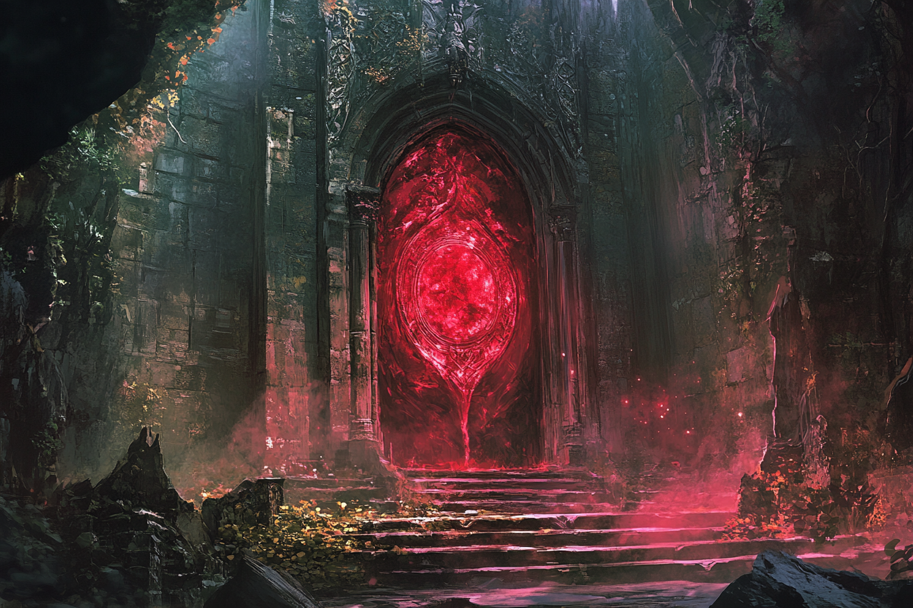

# Rovtal

## Présentation
**Rovtal** est une ville fondée par une ancienne tribu composée de **Sauriens** et de **Varanides**. Autrefois, cette tribu était connue pour ses performances au niveau de l'agriculture, ayant combiné habilement magie et culture afin de pouvoir se sustenter. 

C'est donc avec joie que cette tribu s'est installée dans cette zone lors de l'apparition des stabilisateurs naturels, puisque l'Ouest de la Côte Épineuse est connue de nos jours pour ses terres fertiles et argileuses, et son exposition au soleil. Parmi toutes les cultures différentes, on trouve notamment : des agrumes, des vignes pour la fabrication du vin, des légumes et fruits charnus et juteux, ainsi que des baies de toutes sortes.

La ville de **Rovtal** est néanmoins particulière puisque le **stabilisateur de leyline naturel** se trouve au fond d'un énorme gouffre qui s'étend sur une très grande distance. De nos jours, la vieille ville se situe au fond du gouffre, alors que les nouveaux bâtiments se construisent tous en surface de ce gouffre.

Au niveau de l'agriculture, les cultivateurs de Rovtal usent fréquemment de la magie afin de s'occuper au mieux de leurs cultures, de changer leurs tailles et leur goût, et même de les faire changer de couleur et de texture pour les mets les plus raffinés et exotiques. Pour cela, ils invoquent les magies des deux dieux les plus populaires de la ville : **Muhuta**, déesse de la Transfrmation et du Renouveau, et **Italis**, dieu de la Vie et de la Mort. 

Le temps passant, la ville s'est agrandie et hiérarchisée. Les terrains cultivés se faisant de plus en plus grands, les savants de Rovtal ont dû trouver un moyen de stabiliser les leylines à une grande distance de leur centre-ville, organisé autour du stabilisateur naturel. Les stabilisateurs artificiels étant inventés, ils en placèrent de plus en plus loin afin de conquérir un territoire plus grand, ce qui a rapidement nécessité une organisation efficace. De nos jours, un seigneur reigne sur Rovtal, et il mandate des représentants dans les villes aux alentours afin de gérer localement les villages. 

Malgré la prévalence des cultes de **Italis** et **Muhuta**, d'autres cultes existent dans Rovtal, mais leurs traditions et croyances sont moins connues du grand public. On citera notamment le culte de **Komorath**, dieu de la Tromperie et des Arts Obscurs, qui se font appeler les **Sombres Artistes**. Dans le secret, ce culte est dirigé par des **Sombraurs**, des créatures se nourissant de la magie d'autrui pour survivre, créatures qui ont été créées (et qui le sont toujours) via un long rituel à la gloire de **Komorath**. Ces **Sombraurs**, dirigés par [**Federi Gox**](../PERSONNAGES/SOMBRES_ARTISTES/Federi_Gox.md), aidé par le seigneur local [**Ethérios Sfer**](../PERSONNAGES/SOMBRES_ARTISTES/Ethérios_Sfer.md), tirent en réalité les ficelles derrière beaucoup des mouvement politiques de la région.

## Lieux 
### La guilde des ingénieurs

La **Guilde des Ingénieurs**, située au point le plus bas de la **Surface**, abrite tous les esprits pratiques les plus affûtés de la ville. Gérée par la famille [Botzaris](../PERSONNAGES/ROVTAL/GROUPES/Famille_Botzaris.md).

La **Guilde** a travaillé dans les plus gros projets urbains de la ville, comme notamment :
* **Pont du Détroit** : A nécessité l'utilisation de la magie pour tout stabiliser lors de la construction des piles et certaines fondations ;
* **Système d'Ascenseurs Ethériques** : Ont utilisé les recherches fondamentales de l'**Ecole d'Ethérologie** ;
* **Renforcement des Murs de la Ville**
* (*En cours de construction*) **Réseau de Canalisations Magiques** : Pour les Tréfonds uniquement afin que chaque foyer ait accès à une source magique près de chez soi (nécessite de grosses excavations) ;
* (*En cours de conception*) **Tour de Contrôle des Tempêtes** : Projet visant à contrôler localement la météo.

### L'Ecole d'Ethérologie
L'**Ecole d'éthérologie**, située à la **Surface**, est l'une des principales sources d'attrait de la ville  de **Rovtal**. Plusieurs habitants de la région s'y rendent pour y apprendre plus sur la magie qui a fait la renommée de la ville, ainsi que pour apprendre plus sur les éthers.

L'**Ethérologie** reste une science profondément inscrite dans la **religion**, puisqu'on pense que ce sont les **dieux** qui prête leurs magies aux mortels.

L'entrée de l'école est **libre** pour chacun, l'accès au hall principal est ouvert à tous, et l'amphithéâtre des étudiants débutants est ouvert au public. Les autres lieux demeurent interdits d'accès, mais une autorisation de la part de n'importe quel professeur suffit à y accéder en sa compagnie.

#### Vue de l'extérieur

#### Vue du hall principal

#### Vue de la salle de cours principale

#### Amphithéâtre principal

#### Salle de travaux pratiques

### Le Pont du Détroit

Le **Pont du Détroit** est l'un des premières structures que l'on peut rencontrer en venant à **Rovtal** depuis l'**Est**.

**Rovtal** étant construite autour d'un gouffre, il est assez difficile de descendre dans les **Tréfonds** sans passer par des points de contrôles bien gardés. Vers l'Est, c'est le **Pont du Détroit** qui assure cette position.

Situé un peu en marge de la ville, il est entouré de plusieurs arcades (côté ville), sous lesquelles se trouvent plusieurs étales, qui servent de commerce pour toute personne venant près de la ville sans vouloir y entrer.

Des membres de la garde sont présents près du pont, mais cela n'empêche pas quelque brutes locales, les **Brigands du Détroit**, de sévir, notamment grâce à leur chef [**Edem Kurt**](../PERSONNAGES/ROVTAL/EdemKurt.md), qui n'hésite pas à les corrompre.

### Entrée de la ville - La Porte du Pont

### Le Temple d'Italis (Surface)

### Le Temple de Muhuta (Surface)

### Le Temple de Komorath (Surface)

### Marché de Rovtal

### Ascenseur vers les Tréfonds

### Cristaux de lumière et de chaleur

### Maison de la [Famille Sfer](../PERSONNAGES/ROVTAL/GROUPES/Famille_Sfer.md)

Située dans les **Tréfonds**, c'est le manoir où habitent la quasi-totalité des membres de la famille **Sfer**.

Le sous-sol abrite la crypte familiale, où sont notamment enterrés l'ensemble de la lignée des [**Ethérios**](../PERSONNAGES/SOMBRES_ARTISTES/Ethérios_Sfer.md).

### Le Stabilisateur Naturel

### Le Réseau de Caves
La ville de Rovtal ayant son centre-ville caché dans un gouffre gigantesque, elle abrite naturellement un système de caves très complexe dans ses **Tréfonds**.

Ces caves sont peu *civilisées* et sont occupées par des animaux et bêtes en tout genre, ainsi que des citoyens pauvres.

## Les Sombres Artistes

Les **Sombres Artistes** est une organisation qui se cache derrière le culte de [**Komorath**](../COSMOLOGIE/PLANS_ET_DIVINITES/Komorath.md), décrié mais pas secret. Elle se sert de la devanture du culte pour pouvoir agir sans être embêtée.

Derrière cette organisation, se cache les **Mains Noires**, la tête pensante des **Sombres Artistes**, qui sont dans leur intégralité des [**Sombraurs**](../ESPECES/ESPECES_MAGIQUES/Sombraur.md), aussi appelés **Fils-des-Ombres**. L'organisation est née sous l'impulsion de [**Federi Gox**](../PERSONNAGES/SOMBRES_ARTISTES/Federi_Gox.md), le premier **Sombraur**, qui est actuellement en hibernation, afin de recréer l'ancien clan qu'il avait monté, avant la [**Catastrophe Magique**](../AUTRES/CatastropheMagique.md).

Les intentions des **Sombres Artistes** n'est pas très claire. Ils partagent cependant tous une idéologie commune : ils voient dans leur dieu, **Komorath**, une sorte de **sauveur** qui leur donne une raison d'exister au-delà de leur simple individualité.

De nos jours, ils essayent également de développer leur sens de la communauté afin de contrer l'influence des **familles nobles** dans la ville, qui n'a pas grand-chose à faire de la *populace*. Leurs actions servent également à faciliter la vie de leurs **leaders** dans la société.

## Les Brigands du Détroit
Cette organisation est une bande de voleurs locaux, sévissant près du [Pont du Détroit](#le-pont-du-détroit), qui profitent de l'ignorance de certains visiteurs de la ville pour s'enrichir. 

Ils essaient de rester loin de toute garde près du **Pont**, mais cela ne leur empêche pas de corrompre certains d'entre eux.

Ils sont dirigés par [**Èdem Kurt**](../PERSONNAGES/ROVTAL/EdemKurt.md).

## Événements marquants
* **95** : Arrivée de [Federi Gox](../PERSONNAGES/SOMBRES_ARTISTES/Federi_Gox.md), [Alvaro Shenzi](../PERSONNAGES/SOMBRES_ARTISTES/Alvaro_Shenzi.md) et [Maria Ufassa](../PERSONNAGES/SOMBRES_ARTISTES/Maria_Ufassa.md).
* **162** : Création de l'[**Ecole d'Ethérologie**](#lecole-dethérologie).
* **173** : Invention des **stabilisateurs artificiels** de leyline par la toute naissante [**Ecole d'Ethérologie**](#lecole-dethérologie).

## Traditions et particularités
### La Surface, les Flancs et les Tréfonds

### Place des familles nobles et prestigieuses

### La Police de Rovtal
La **Police de Rovtal** est l'organisme qui s'occupe de faire régner l'ordre dans la ville. Plusieurs districts existent, et opèrent de façon plus au moins indépendante. Les deux plus grands districts sont :
* Le **District de la Surface** ;
* Le **District des Tréfonds**.

Le **District des Tréfonds** s'occupe quasiment exclusivement des problèmes liés aux nobles.

Le **District de la Surface** abrite la plus grande prison, dans laquelle sont entassés les prisonniers du **District des Tréfonds** également.

La plupart des membres de la police souhaitent être promus pour aller exercer au **District des Tréfonds**.

#### District de la Surface

#### District des Tréfonds

### Fortes inégalités entre les quartiers

**Rovtal** est connu pour être très inégalitaire, et cela se voit lorsqu'on se balade dans les différentes quartiers de la ville.

Les **Tréfonds** sont connus pour être le vieux quartier de la ville et où se trouvent l'ensemble des **familles nobles**, et donc par extension le quartier richer, alors que c'est à la **Surface** où se trouvent les autres individus, notamment les habitants qui ne sont pas originaires de **Rovtal**.

### Place de l'agriculture dans la ville

## Personnages importants de la ville

### La famille royale
* [Famille Andreadis](../PERSONNAGES/ROVTAL/GROUPES/Famille_Andreadis.md)

### Les familles nobles
* [Famille Sfer](../PERSONNAGES/ROVTAL/GROUPES/Famille_Sfer.md)
* [Famille Kutt](../PERSONNAGES/ROVTAL/GROUPES/Famille_Kutt.md)
* [Famille Alexandros](../PERSONNAGES/ROVTAL/GROUPES/Famille_Alexandros.md)
* [Famille Botzaris](../PERSONNAGES/ROVTAL/GROUPES/Famille_Botzaris.md)
* [Famille Zografos](../PERSONNAGES/ROVTAL/GROUPES/Famille_Zografos.md)

### Les familles prestigieuses
* [Famille Kwestyon](../PERSONNAGES/ROVTAL/GROUPES/Famille_Kwestyon.md)
* [Famille Andreou](../PERSONNAGES/ROVTAL/GROUPES/Famille_Andreou.md)
* [Famille Lambrakis](../PERSONNAGES/ROVTAL/GROUPES/Famille_Lambrakis.md)
* [Famille Petrakos](../PERSONNAGES/ROVTAL/GROUPES/Famille_Petrakos.md)
* [Famille Giannaris](../PERSONNAGES/ROVTAL/GROUPES/Famille_Giannaris.md)

## Images
### Surface

### Flancs

### Tréfonds

### Intérieurs

### Lieux spéciaux

### Personnes

