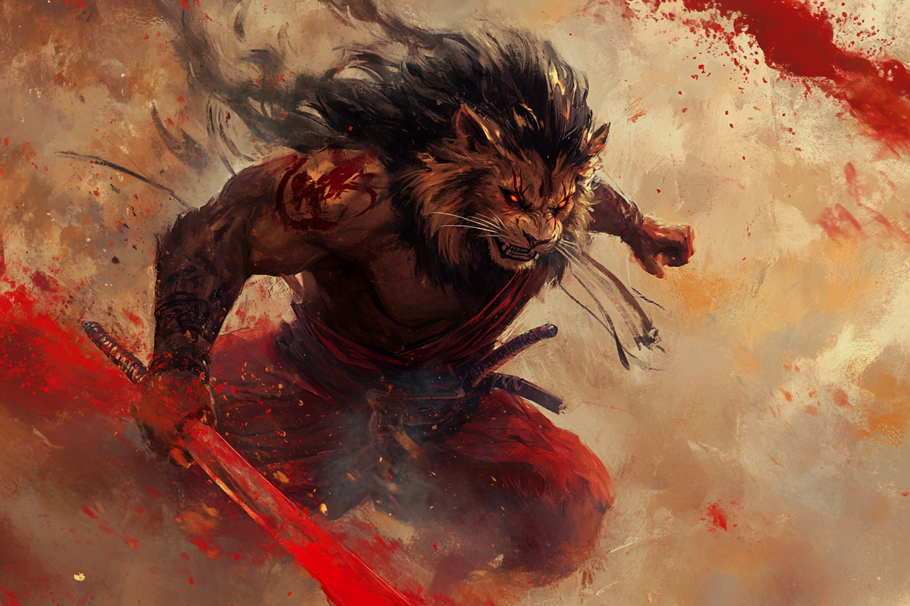
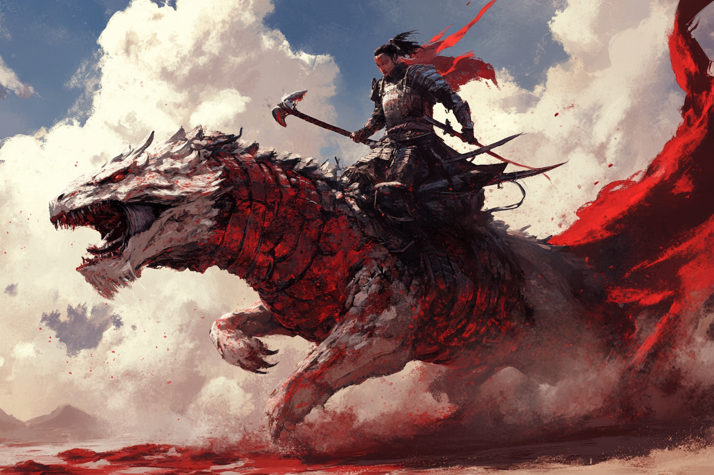
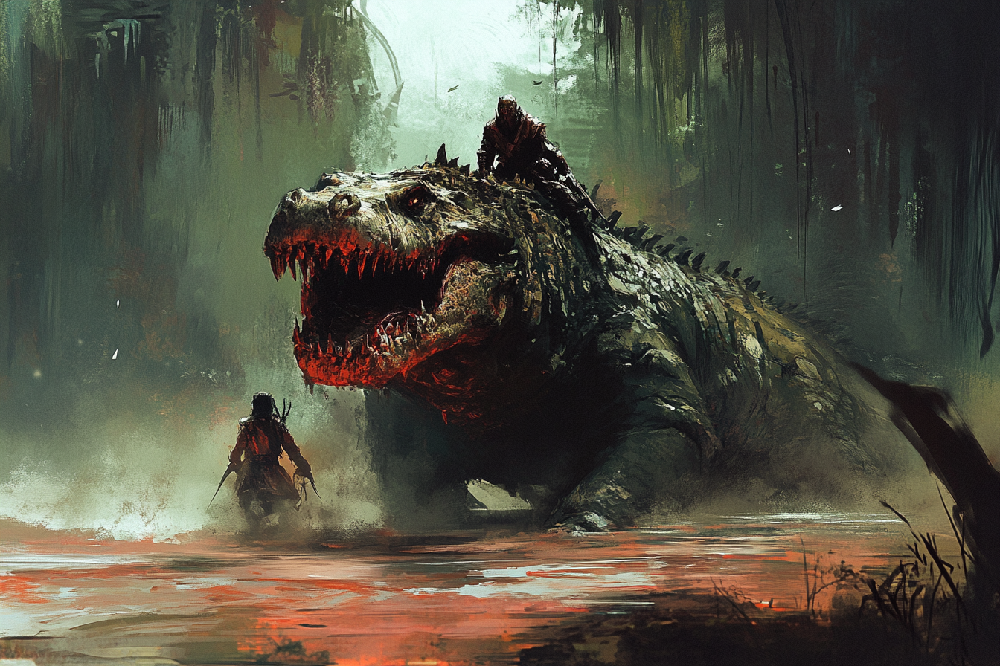

# Tchevo

**Tchevo** est construite autour d'un stabilisateur naturel de leyline. On y trouve surtout des **Tigryliens** et des **Léonins**, dans une zone semi-aride.

Les habitants de **Tchevo** s'appuient beaucoup sur l'exploitationd des ressources proches de leurs villes, et mènent parfois des expéditions dans des régions arides, voires désertiques. Ils se servent alors de **cristaux** qu'ils transportent sur le dos afin de ne pas se déshydrater en magie.

Les habitants de **Tchevo** ont réussi à maîtriser l'insufflation de magie dans leurs corps afin de devenir plus puissant momantanément. L'invocation de cette magie passe souvent par de l'automutilation car cette magie passe plus facilement à travers le système sanguin. Ils rentrent alors généralement dans une rage folle.

Les habitants de Tchevo utlisent généralement des montures géantes, des reptiles, avec lesquelles ils communiquent.

